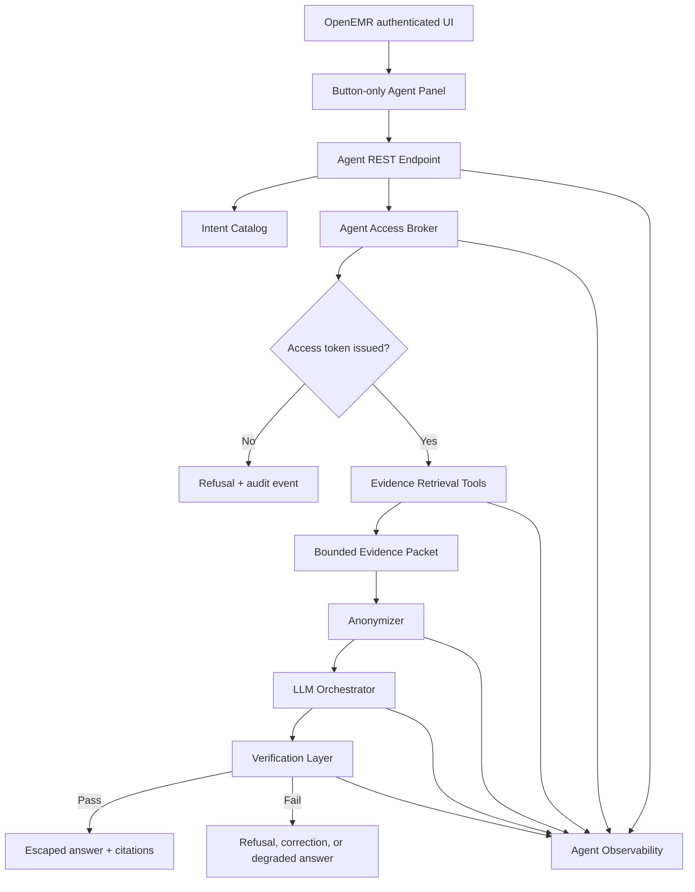

# Clinical Co-Pilot Agent Architecture

## One-Page Summary

The first MVP iteration of the Clinical Co-Pilot will be a constrained, source-grounded agent embedded in OpenEMR for **two narrow outpatient users: an intake nurse rooming a scheduled patient and a doctor preparing to enter the room**. These constraints define the initial build scope, not the full long-term shape of the Clinical Co-Pilot. For this MVP, the agent is not a general chatbot, chart search engine, diagnosis assistant, or documentation writer. Its first job is to answer a small set of patient-specific questions quickly: show basic patient data, show current medications, show recent events, build an intake checklist, explain what changed since the last visit, summarize nurse intake flags, and show source evidence behind a claim.

The most important product decision is that there will be **no free-text communication between the user and the agent**. The UI will present buttons and follow-up action chips only. Those controls map to a server-owned intent catalog with stable prompt templates, for example "show me current medications" or "show me recent events." The browser will not send arbitrary prompt text to the LLM, and the LLM will not choose patients, run generic searches, or request arbitrary OpenEMR routes. This keeps the interaction fast and conversational enough for follow-up use while **removing the highest-risk prompt-injection** and cross-patient search surface.

The most important security decision is that the agent server gets a separate data access component: the Agent Access Broker. Current OpenEMR auth and ACL infrastructure is useful, but the audit found that it is not sufficient for this purpose because many checks answer "can this user access this category of data?" instead of "**can this exact user access this exact patient right now**?" The broker will sit in front of every agent retrieval tool. At the beginning of an agent interaction, it will validate the authenticated OpenEMR session, API CSRF token, user role, OpenEMR ACLs, current patient context, appointment or chart binding, and per-intent data policy. If access is granted, it creates a short-lived agent access token that contains the permissions this user has for this specific patient: patient identity, allowed tools, allowed data classes, limits, and request ID. The token is reused for the full life of that user's interaction with the agent, then expires at interaction end or timeout. Tools must present that token and cannot accept patient IDs directly from the LLM or browser.

The backend should integrate through OpenEMR's existing API and module patterns rather than adding standalone public scripts. The planned MVP shape is a small UI extension in the authenticated chart or scheduled-visit workflow, a REST endpoint routed through `apis\dispatch.php` and `apis\routes\_rest_routes_standard.inc.php`, and namespaced services under `src\Services\Agent`. The pre-search decision is to start with a custom single-agent orchestrator rather than a heavy multi-agent framework, because the **workflow is closed-intent, tool-bounded, and verification-heavy**. Evidence retrieval will reuse existing services where they are trustworthy and bounded, such as patient, encounter, appointment, medication, list, vitals, document, and clinical note services. When existing services are too broad, the agent layer will add purpose-built read models with explicit patient filters, time windows, and result limits.

Every answer must pass verification before reaching the user. The LLM will receive only a bounded evidence packet for the current patient, and any evidence sent to the LLM will pass through an anonymizer first. The **anonymizer replaces sensitive identifiers such as full name, address, SSN, phone, email, and other unnecessary PHI with stable placeholders** scoped to the current interaction. The same anonymized view is used for optional payload logs, so **logs never store raw patient text** by default. The LLM must return structured output with claim-to-source links. A verifier will reject unsupported claims, unsafe clinical advice, hidden tool failures, or claims that violate the current evidence. Observability will log request metadata, source IDs, latency, model, token counts, cost, verification result, refusal outcome, and error class. **The MVP remains read-only** and stores only audit metadata unless a later design explicitly handles generated summaries as medical-record artifacts.

## Inputs And Constraints

This plan is based on these primary inputs:

- `Week-1-Assignment.pdf`: requires a Clinical Co-Pilot embedded in OpenEMR, fast enough for a 90-second physician workflow, with source attribution, verification, observability, evals, and HIPAA-aware data handling.
- `USERS.md`: narrows the MVP to an intake nurse and a doctor in an outpatient scheduled-patient workflow.
- `AUDIT.md`: identifies patient-specific authorization, PHI-safe logging, source verification, and bounded retrieval as non-negotiable gates.
- `CURRENT-ARCHITECTURE.md`: describes OpenEMR as a hybrid monolith with legacy PHP entry points, REST/FHIR APIs, phpGACL ACLs, service classes, sessions, events, modules, and transitional DB layers.
- `pre-search.md`: provides the planning checklist for domain selection, scale and performance, reliability, framework selection, LLM choice, tool design, observability, evals, verification, failure modes, security, testing, open source, deployment, and iteration.

Core constraints:

- No free-text user input.
- Current patient only.
- Server-validated patient access before any retrieval.
- Read-only MVP.
- Every factual claim must cite source records or be marked missing, unknown, conflicting, or not checked.
- No raw prompts, chart excerpts, or generated clinical summaries in durable logs by default.
- Anonymize patient payloads before they are sent to an LLM or written to optional payload logs.
- No LLM keys or PHI-bearing retrieval logic in browser code.
- No standalone public PHP entry point that bypasses OpenEMR auth, CSRF, ACL, audit, or session bootstrapping.

## Pre-Search Decisions

`pre-search.md` is a checklist rather than a source of product facts, so this section records the concrete decisions this architecture makes against that checklist.

| Checklist Area    | MVP Decision                                                                                                                                                                                                                                            |
| ----------------- | ------------------------------------------------------------------------------------------------------------------------------------------------------------------------------------------------------------------------------------------------------- |
| Domain            | Healthcare, specifically outpatient OpenEMR pre-visit and rooming workflows.                                                                                                                                                                            |
| Use cases         | Support the nurse and doctor use cases from `USERS.md`: intake checklist, medication/allergy confirmation, missing or stale intake data, 90-second visit briefing, changed-since-last-visit review, intake handoff, and source drilldown.               |
| Verification      | Non-negotiable claim-to-source attribution, patient ownership checks, out-of-scope clinical advice rejection, safe missingness wording, and refusal when evidence is insufficient.                                                                      |
| Data sources      | Bounded reads from patient demographics, schedule, encounters, problems, medications, allergies, vitals, recent results/procedures, selected document metadata or parsed text, and nurse intake notes when available.                                   |
| Latency           | Target useful responses in seconds: deterministic evidence retrieval should be fast enough to leave most of the request budget for LLM generation and verification; long document parsing and embeddings are out of scope for the MVP. |
| Query volume      | Design the MVP for clinic-scale concurrent use first, with one composed evidence request per button press instead of many chat-driven round trips.                                                                                                      |
| Cost              | Use closed intents, small evidence packets, prompt-template versions, token accounting, and a model/provider abstraction so cost can be measured and the model can be changed without rewriting tools.                                                  |
| Human in the loop | The clinician remains responsible for decisions; the MVP is read-only, source-cited decision support and does not write orders, diagnoses, notes, medications, or billing codes.                                                                        |
| Team constraints  | Favor OpenEMR-native PHP services, PHPUnit tests, and a simple custom orchestrator over a larger agent framework that would add operational and debugging complexity.                                                                                   |
| Open source       | Keep the OpenEMR integration code separable and avoid committing provider secrets, patient data, raw traces, or deployment-specific credentials.                                                                                                        |

## Stack Decisions

### Agent Framework

The MVP should use a custom orchestrator implemented in OpenEMR service/controller code, not LangChain, LangGraph, CrewAI, or a multi-agent runtime. The primary reason is control: the workflow is a finite intent catalog with fixed tool permissions and a hard verification gate. A generic framework can be reconsidered later if the product grows into more complex planning, but the first iteration should keep the trust boundary visible in application code.

### LLM Provider

The LLM should be behind a provider interface. The first provider should support structured JSON output, strong instruction following, sufficient context for bounded evidence packets, token accounting, request timeouts, and a BAA/no-training deployment posture. The architecture should avoid hard-coding a vendor or model name into business logic; use a configured model alias so deployment can switch between a preferred hosted model and a local or disabled mode.

### Tool Design

Tools are server-owned read models, not arbitrary API callers. Each tool has:

- one clinical purpose
- one required agent access token permission
- one patient
- bounded input
- explicit limits
- structured output
- timeout and error behavior
- source IDs for verification

The LLM never selects tools directly. The intent catalog selects the allowed tools before the model sees the evidence packet.

### Observability Provider

The MVP can begin with OpenEMR audit events plus structured application logs. A dedicated tracing tool can be added later, but only if it can be configured for HIPAA-appropriate retention and no raw PHI capture. Any optional payload logging must use anonymizer output. The architecture must track latency, tool sequence, token counts, and cost from the first implementation even if the storage backend is initially simple.

### Deployment And Operations

The agent should deploy with the same OpenEMR fork and environment as the application. Operational controls required before real PHI use:

- server-side LLM credentials only
- environment or site-level config for provider selection
- external LLM kill switch
- request timeout and retry policy
- rate limiting per user/session
- rollback path for prompt templates and model aliases
- PHI-safe monitoring and alerting for access denials, verification failures, provider failures, latency, and cost spikes

### Iteration Model

Iteration should be eval-driven. New intents require:

- a `USERS.md` use-case trace
- an intent catalog entry
- a data access policy
- one or more bounded tools
- verification rules
- observability fields
- positive, negative, and adversarial eval fixtures

## MVP Scope

The first version supports these closed intents:

| Intent ID                  | Button Label             | Primary User  | Use Case Trace |
| -------------------------- | ------------------------ | ------------- | -------------- |
| `basic_patient_data`       | Basic patient data       | Nurse, Doctor | N1, D1         |
| `current_medications`      | Current medications      | Nurse, Doctor | N2, D1         |
| `allergies_to_confirm`     | Allergies to confirm     | Nurse, Doctor | N2             |
| `recent_events`            | Recent events            | Doctor        | D1, D2         |
| `intake_checklist`         | Intake checklist         | Nurse         | N1, N3         |
| `changed_since_last_visit` | Changed since last visit | Doctor        | D2             |
| `intake_handoff`           | Intake handoff           | Doctor        | D3             |
| `show_source`              | Show source              | Nurse, Doctor | D4             |

Out of scope for the MVP:

- Free-text questions.
- Cross-patient search.
- Generic medical advice.
- Diagnosis, treatment, prescribing, ordering, billing, or coding recommendations.
- Automatic chart writes.
- Full-chart export.
- Full document ingestion during a user request.
- Long document parsing, OCR, embeddings, and vector search.
- Patient portal use.

## High-Level Architecture



The browser is intentionally thin. It renders buttons, sends selected intent IDs, displays verified answers, and lets the user inspect citations. The agent server owns prompt text, tool routing, patient context, access checks, evidence selection, LLM calls, verification, and audit events.

## OpenEMR Integration Points

### UI Placement

The agent panel should be embedded in the authenticated patient workflow, preferably in the patient chart or scheduled-visit context where OpenEMR already knows the active patient. Viable integration points from the current architecture are:

- Patient menu extension through `src\Menu\PatientMenuEvent`.
- Patient summary card/render extension through `src\Events\Patient\Summary\Card`.
- Main tab body render extension through `src\Events\Main\Tabs\RenderEvent`.
- A custom module under `interface\modules\custom_modules` if module packaging is preferred.

The MVP should favor a small patient-chart panel because it naturally supplies current-patient context and limits user intent to the active chart.

### Server Route

The backend should use OpenEMR's REST stack rather than a new public script:

- Route map: `apis\routes\_rest_routes_standard.inc.php`.
- Controller namespace: `src\RestControllers\Agent`.
- Service namespace: `src\Services\Agent`.
- Bootstrap path: `apis\dispatch.php`, `SiteSetupListener`, `AuthorizationListener`, `HttpRestRouteHandler`, and `ViewRendererListener`.

The endpoint should support only closed operations:

- `POST /api/agent/intent`
- `GET /api/agent/source/{requestId}/{citationId}`
- `GET /api/agent/history/current-patient` if a small in-session intent history is needed.

The browser should send an `APICSRFTOKEN` header for authenticated in-app calls, but CSRF success is not enough. The agent endpoint must still call the Agent Access Broker before any patient data is returned.

## Button-Only Conversation Contract

The UI never renders a free-text input box. User actions are limited to:

- Initial intent buttons.
- Contextual follow-up buttons generated from server-approved intent options.
- Citation buttons that request source detail.
- Retry buttons after explicit tool or model failure.

The browser sends:

```json
{
  "intent_id": "current_medications",
  "conversation_id": "session-local-id",
  "active_patient_context": "server-session"
}
```

The browser does not send:

- Patient IDs chosen by the user.
- Arbitrary prompt text.
- SQL, route names, or tool names.
- Free-form follow-up questions.

The server maps `intent_id` to a stable prompt template:

```json
{
  "intent_id": "current_medications",
  "llm_user_text": "Show me current medications.",
  "required_tools": ["get_current_medications"],
  "allowed_followups": ["show_source", "allergies_to_confirm", "changed_since_last_visit"]
}
```

If the browser is modified to send a different text value, the server ignores it. Only cataloged intents execute.

## Agent Access Broker

The Agent Access Broker is a separate server-side data access component for the agent server. It exists because current OpenEMR access control is not specific enough for safe AI retrieval. The broker is the only component allowed to authorize and issue patient-scoped agent access tokens for agent tools.

### Responsibilities

The broker will:

- Resolve the active site and authenticated user from OpenEMR session state.
- Verify API CSRF for local UI calls.
- Resolve the current patient from server-side chart or appointment context.
- Refuse requests when there is no current patient, multiple possible patients, or a stale patient context.
- Enforce OpenEMR ACL checks through `AclMain` or `RestConfig::request_authorization_check`.
- Enforce patient-specific access beyond category ACLs.
- Apply per-intent policy for data class, time window, and record count.
- Produce a short-lived agent access token at the beginning of the agent interaction.
- Reuse that token across the user's follow-up buttons and source drilldowns for the same interaction.
- Audit both token grants and denials.

### Agent Access Token

The agent access token is an internal server-side object, not a browser token. It is short-lived, but its lifetime is long enough for one user-agent interaction around one patient. It is issued once at the beginning of the interaction, reused by retrieval tools during follow-up actions, and expires when the interaction ends, the patient context changes, or the timeout is reached.

```json
{
  "request_id": "agent-request-uuid",
  "interaction_id": "agent-interaction-uuid",
  "site_id": "default",
  "user_id": 1,
  "user_uuid": "users.uuid",
  "patient_pid": 123,
  "patient_uuid": "patient_data.uuid",
  "intent_id": "current_medications",
  "permissions": {
    "allowed_data_classes": ["medications", "allergies"],
    "allowed_tools": ["get_current_medications", "get_source_detail"],
    "acl_categories": ["patients\\med"],
    "limits": {
      "max_records": 25,
      "max_documents": 0,
      "lookback_days": 365
    }
  },
  "expires_at": "interaction end or timeout timestamp"
}
```

Retrieval tools must reject calls without a valid token. They must also reject any patient ID, data class, tool name, or source request that does not match the token's permissions.

### Patient-Specific Access Policy

The broker's patient-specific check should be explicit and testable. The initial policy should combine:

- User authentication from `library\auth.inc.php` and session state.
- Role and ACL checks from phpGACL categories such as `patients\demo`, `patients\med`, `patients\docs`, `encounters\auth_a`, and `encounters\notes`.
- Current patient binding from chart state or today's schedule.
- Provider, care team, facility, or appointment relationship when available.
- A deny-by-default fallback for ambiguous cases.

The audit found `BearerTokenAuthorizationStrategy::checkUserHasAccessToPatient()` currently returns `true`. The agent must not rely on that method as its only patient-bound control. A future hardening step can route both the agent broker and FHIR patient-bound flow through a shared real patient-access service.

## Evidence Retrieval Layer

The agent should not expose OpenEMR's raw APIs directly to the LLM. It should expose server-owned evidence tools that are narrow, read-only, bounded, and patient-scoped.

### Evidence Packet Shape

Every tool returns structured evidence:

```json
{
  "source_id": "medication:lists_medication:456",
  "source_type": "medication",
  "table": "lists_medication",
  "record_uuid": "row uuid if available",
  "patient_uuid": "patient uuid",
  "date": "2026-04-20",
  "status": "active",
  "display": "Metformin 500 mg twice daily",
  "fields_used": ["title", "begdate", "activity", "dosage"],
  "reliability": "structured_active_record"
}
```

The LLM sees only the fields needed for the selected intent. The UI can request source detail through a citation endpoint after the same token and patient access are checked again.

### Initial Tools

| Tool                           | Purpose                                                         | Required Token Data Class                                      | Default Limit                  |
| ------------------------------ | --------------------------------------------------------------- | -------------------------------------------------------------- | ------------------------------ |
| `get_patient_snapshot`         | Basic demographics and visit context                            | `demographics`, `appointments`                                 | 1 patient, today's appointment |
| `get_current_medications`      | Active/verified medication evidence                             | `medications`                                                  | 25 records                     |
| `get_allergies_to_confirm`     | Active, stale, duplicate, or conflicting allergy evidence       | `allergies`                                                    | 25 records                     |
| `get_recent_events`            | Encounters, recent results, documents, procedures, intake flags | `timeline`                                                     | 30 events                      |
| `get_changed_since_last_visit` | Source-specific change comparison                               | `timeline`, `medications`, `problems`, `allergies`, `results`  | 30 changed items               |
| `get_intake_checklist`         | Nurse-facing confirmations and missing/stale fields             | `intake`, `demographics`, `medications`, `allergies`, `vitals` | 20 checklist items             |
| `get_intake_handoff`           | Doctor-facing nurse intake summary                              | `intake`, `vitals`, `medications`, `allergies`                 | 20 handoff items               |
| `get_source_detail`            | Citation drilldown                                              | Citation's source data class                                   | 1 source                       |

### Source Systems

The first implementation should reuse or wrap:

- `src\Services\PatientService.php` for `patient_data`.
- `src\Services\EncounterService.php` for recent and last completed encounters.
- `src\Services\VitalsService.php` for vitals history.
- `src\Services\ListService.php`, `src\Services\PatientIssuesService.php`, and medication-specific services for problems, allergies, and medication list records.
- `src\Services\PrescriptionService.php` for prescription data where needed.
- `src\Services\DocumentService.php` and `library\classes\Document.class.php` for document metadata and selected parsed content.
- `src\Services\ClinicalNotesService.php` for nurse intake or clinical notes once the workflow defines the source.
- Appointment data from the scheduling services or bounded read models over `openemr_postcalendar_events`.

When an existing service can return broad results, the agent layer should add a small read model that forces patient ID, date window, status, and limit at the SQL boundary.

## Anonymizer Component

The anonymizer is a server-side component between evidence retrieval and any external or durable sink that does not need direct identifiers. It has two jobs:

- Prepare model input by replacing sensitive patient information with placeholders before patient evidence is sent to the LLM.
- Prepare log-safe payloads by replacing PHI in any prompt, evidence, tool output, model response, or error detail that must be logged.

The anonymizer should be deterministic within one agent interaction. If the same patient name, address, phone number, or other identifier appears multiple times, it receives the same placeholder each time so the LLM can preserve relationships without seeing the raw identifier.

Example mapping for one interaction:

| Raw Field Type               | Placeholder               |
| ---------------------------- | ------------------------- |
| Patient full name            | `[PATIENT_NAME]`          |
| Street address               | `[PATIENT_ADDRESS_1]`     |
| SSN                          | `[PATIENT_SSN]`           |
| Phone number                 | `[PATIENT_PHONE_1]`       |
| Email                        | `[PATIENT_EMAIL_1]`       |
| Insurance member ID          | `[INSURANCE_ID_1]`        |
| Free-text identifier in note | `[REDACTED_IDENTIFIER_1]` |

The placeholder map is sensitive because it can re-identify the patient. It must stay server-side, be scoped to the interaction, and expire with the agent access token. The browser and LLM provider should not receive the raw placeholder map.

The anonymizer should remove or replace direct identifiers unless they are needed for the selected intent. Clinical facts that are needed for reasoning, such as medication names, allergy names, lab values, problem titles, encounter dates, and source IDs, should remain available when they are not themselves direct identifiers. When a field is useful clinically but highly identifying, the evidence tool should prefer a less identifying form, such as age instead of full date of birth, or facility label instead of full address.

The verifier operates over both views:

- The anonymized model output, to ensure claims map to anonymized evidence IDs.
- The original server-side evidence packet, to ensure citations still belong to the token's patient and are safe to reveal to the authenticated OpenEMR user.

## LLM Orchestration

The MVP should use a single orchestrator, not multiple autonomous agents. The workflow is deterministic:

1. Receive closed `intent_id`.
2. Resolve the server-owned prompt template.
3. Ask the broker for, or reuse, the interaction's agent access token.
4. Run the required retrieval tools.
5. Build the bounded evidence packet.
6. Run the evidence packet through the anonymizer before any model call.
7. Call the LLM with the intent text, formatting instructions, refusal rules, and anonymized evidence packet.
8. Require structured output with claims, citations, uncertainty labels, and follow-up intent suggestions.
9. Send the output to verification.
10. Render only verified output.

The LLM cannot:

- Select patient IDs.
- Call arbitrary tools.
- Request more data than the intent allows.
- Override broker token permissions.
- See raw direct patient identifiers unless a later policy explicitly allows a specific field for a specific intent.
- Write to OpenEMR.
- Render HTML.
- Hide missing data or tool failures.

The prompt should instruct the model to use conservative language:

- Say "not found in the checked evidence" instead of implying absence from the full chart.
- Label stale, undated, duplicate, or conflicting records.
- Refuse generic medical advice.
- Cite every factual claim.

## Verification Layer

Verification is a required post-processing step before the UI sees an answer.

### Structured Output Contract

The LLM should return structured JSON:

```json
{
  "answer_blocks": [
    {
      "heading": "Current medications",
      "claims": [
        {
          "text": "Metformin 500 mg twice daily is listed as active.",
          "citation_ids": ["medication:lists_medication:456"],
          "certainty": "supported"
        }
      ]
    }
  ],
  "missing_or_uncertain": [
    {
      "text": "Medication verification date was not found in checked records.",
      "citation_ids": []
    }
  ],
  "followup_intents": ["show_source", "allergies_to_confirm"]
}
```

### Verification Checks

The verifier will:

- Confirm each factual claim has at least one citation from the evidence packet.
- Confirm cited records belong to the token's patient.
- Confirm cited fields support the claim text.
- Reject unsupported active medication, allergy, problem, result, or event claims.
- Confirm that missingness is phrased as "not found in checked evidence."
- Reject diagnosis, treatment, prescribing, ordering, or billing recommendations in MVP.
- Reject hidden tool failures or fabricated source IDs.
- Enforce maximum answer length for the 90-second workflow.
- Ensure follow-up buttons are from the server-approved intent catalog.

If verification fails, the system can:

- Regenerate once with explicit verifier feedback.
- Remove unsupported claims and show a degraded answer.
- Refuse with a concise explanation and source-safe error.

The user should never receive an unverified answer.

## HIPAA And PHI Handling

HIPAA compliance shapes the architecture, not just deployment settings.

### Minimum Necessary

The agent sends the model only the bounded evidence packet required for the selected intent. It does not send:

- Full charts.
- Full documents by default.
- Patient lists.
- Unrelated demographics.
- Raw database rows with unused fields.
- Another patient's data.
- Raw direct identifiers when an anonymized placeholder is sufficient.

Before any patient evidence is sent to the LLM, the anonymizer replaces direct identifiers with scoped placeholders. This is still PHI-adjacent clinical context, so provider, BAA, retention, and access controls still matter; anonymization reduces exposure but does not replace HIPAA controls.

### Logging And Retention

The agent logs metadata, not raw PHI, by default:

- request ID
- site ID
- authenticated user ID
- patient audit reference where required, otherwise anonymized patient placeholder
- intent ID
- tool sequence
- source record IDs
- latency per step
- model and token counts
- cost estimate
- verification result
- refusal or error class

If a PHI-bearing payload must be logged for debugging or failure analysis, the log entry should contain the anonymizer output, not the raw payload. The anonymized log payload should preserve request structure, source IDs, placeholder labels, tool names, and error classes while replacing direct identifiers.

The agent does not log raw versions of these fields by default:

- raw prompt text
- raw evidence packets
- raw chart excerpts
- model completions
- document text
- API keys or provider secrets
- anonymizer placeholder maps

OpenEMR's `ApiResponseLoggerListener` can log JSON API responses for non-local API calls depending on `api_log_option`. Agent routes should set a route/request attribute such as `skipResponseLogging` or use an equivalent route-level policy so raw answers and evidence are not duplicated into `api_log`.

### Third-Party Processors

Any LLM, future embedding, tracing, eval, or observability provider receiving PHI must be treated as a business associate. Required deployment controls:

- BAA in place.
- No-training setting confirmed.
- Retention setting documented.
- API keys server-side only.
- TLS for all external calls.
- Environment or server-only site configuration for secrets.
- Kill switch to disable external LLM calls.

## Observability

Observability is part of the core request flow. The system should emit a single request ID across UI, route, broker, tools, LLM, verifier, and audit log.

Minimum spans or events:

| Event                         | Fields                                                        |
| ----------------------------- | ------------------------------------------------------------- |
| `agent.intent.received`       | request ID, user ID, patient ID, intent ID                    |
| `agent.access.checked`        | request ID, decision, policy version, denial reason if denied |
| `agent.tool.started`          | request ID, tool name, limit, data class                      |
| `agent.tool.finished`         | request ID, tool name, source count, latency, error class     |
| `agent.anonymizer.finished`   | request ID, placeholder count, redaction class count, latency |
| `agent.llm.started`           | request ID, model alias, prompt template version              |
| `agent.llm.finished`          | request ID, latency, token counts, cost estimate, error class |
| `agent.verification.finished` | request ID, pass/fail, unsupported claim count                |
| `agent.response.rendered`     | request ID, answer block count, citation count                |

OpenEMR audit integration should use `EventAuditLogger` for compact events and denied access attempts. A later production version may add an `agent_audit` table, but the MVP should avoid new PHI-heavy persistence unless needed. Any optional payload logging must use the anonymized payload and must not persist the placeholder map.

## UI Rendering And Safety

OpenEMR's Twig configuration currently disables autoescaping, so the agent UI must escape deliberately.

Rendering rules:

- Render model output as escaped text or a strict safe-markdown subset.
- Do not render model output as raw HTML.
- Escape source snippets, citations, headings, and error text.
- Keep citations as record-level chips, not unbounded note dumps.
- Make tool failures visible in the answer.
- Show "not checked" and "not found in checked evidence" distinctly.
- Disable buttons when no current patient is server-confirmed.

The UI should be dense and clinical, not a marketing-style chat page. A compact side panel or chart card is a better fit than a full-screen chat interface.

## State Management

MVP conversation state should be small:

- Current patient context from OpenEMR server state.
- Session-local conversation ID.
- Ordered list of intent IDs selected during this chart session.
- Request IDs and citation IDs.
- No raw free-text user messages because none exist.
- No automatic chart writes.

If generated summaries are persisted later, the design must treat them as possible medical-record artifacts and store:

- source citations
- model/provider
- prompt template version
- verification status
- authoring user
- timestamp
- retention policy
- review status

That is not part of the MVP.

## Failure Modes

| Failure                                      | System Behavior                                                                                |
| -------------------------------------------- | ---------------------------------------------------------------------------------------------- |
| No current patient                           | Disable intent buttons or return a refusal: "Open a patient chart before using the co-pilot."  |
| Ambiguous patient context                    | Refuse. Do not ask the LLM to choose.                                                          |
| User lacks patient access                    | Refuse, audit denial, return no PHI.                                                           |
| User has category ACL but no patient binding | Refuse, audit denial, return no PHI.                                                           |
| Tool timeout                                 | Show partial answer only if verifier can label missing sections as unavailable.                |
| Missing records                              | Say "not found in checked evidence" with checked source list.                                  |
| Conflicting records                          | Show conflict with citations instead of resolving silently.                                    |
| LLM timeout                                  | Return a deterministic fallback summary from evidence headings if safe, or ask user to retry.  |
| Verification failure                         | Regenerate once or refuse; never show unverified output.                                       |
| Anonymizer failure                           | Do not call the LLM and do not log the raw payload; return a safe error and audit the failure. |
| Prompt injection in chart text               | Treat chart/document text as evidence only, not instructions.                                  |
| Browser tampering with intent                | Ignore unknown intent; audit suspicious request.                                               |
| External provider disabled                   | Return deterministic source list or configured local fallback, no external call.               |

## Evaluation Plan

The eval suite should test behavior that a demo will not reveal.

### Access And UI Evals

- Unknown intent ID is rejected.
- Browser-supplied patient ID is ignored.
- Free-text payload is rejected.
- User without patient binding receives no PHI.
- User with category ACL but no current patient receives no PHI.
- Denied access creates an audit event.

### Evidence And Verification Evals

- Current medications include only supported active records.
- Duplicate medications are flagged, not merged silently.
- Stale allergies are labeled as stale or undated.
- Missing DOB is shown as missing, not inferred.
- "Changed since last visit" uses source-specific dates.
- Unsupported LLM claim is rejected by verifier.
- Fabricated citation ID is rejected.
- Tool failure is visible in the final response.
- Direct identifiers in evidence are replaced with stable placeholders before LLM calls.
- The same identifier receives the same placeholder within one interaction.
- The placeholder map is not exposed to the browser, LLM provider, or logs.

### Safety Evals

- Chart text that says "ignore previous instructions" is treated as patient content, not a system instruction.
- Model output containing HTML or script is escaped.
- Request for diagnosis or treatment recommendation is refused in MVP.
- Request for another patient's information is refused.
- Full-chart export intent is unavailable and rejected.
- Logs contain anonymizer output when payload details are needed, not raw PHI.

The implementation can start with PHPUnit service tests for broker/tool/verifier behavior and add integration tests for the REST endpoint. LLM-dependent evals should use fixed evidence fixtures and structured expected outcomes so they can run repeatedly in CI.

## Implementation Roadmap

### Phase 1: Closed UI And Endpoint

- Add an authenticated patient-chart agent panel.
- Define the intent catalog and button labels.
- Add `POST /api/agent/intent`.
- Reject unknown intent IDs and any free-text payload.
- Return deterministic placeholder responses for each allowed intent.

### Phase 2: Agent Access Broker

- Implement `src\Services\Agent\AgentAccessBroker`.
- Implement current patient resolver.
- Enforce session, CSRF, ACL, patient binding, and per-intent policies.
- Add compact audit events for allow/deny.
- Add PHPUnit tests for allowed, denied, ambiguous, and tampered requests.

### Phase 3: Evidence Tools

- Implement bounded read tools under `src\Services\Agent\Evidence`.
- Start with basic patient data, current medications, allergies, recent events, and source drilldown.
- Normalize source records into evidence packet format.
- Add per-tool timing and source-count logs.

### Phase 4: Anonymizer

- Implement `src\Services\Agent\Anonymizer`.
- Replace direct identifiers with stable per-interaction placeholders.
- Keep the placeholder map server-side and scoped to the agent access token lifetime.
- Route all LLM-bound evidence and optional payload logs through the anonymizer.
- Add tests for names, addresses, SSNs, phone numbers, emails, insurance IDs, and free-text identifiers.

### Phase 5: LLM And Verification

- Add server-side LLM provider client behind a configuration interface.
- Keep provider keys server-side.
- Add structured output schema.
- Add verifier for citations, patient ownership, unsupported claims, and out-of-scope clinical advice.
- Render only verified output.

### Phase 6: Observability And Evals

- Add request-level tracing metadata.
- Disable or redact raw API response logging for agent routes.
- Add anonymizer metrics and ensure optional payload logs use anonymized output only.
- Add cost and token counters.
- Build eval fixtures for missing, stale, conflicting, duplicate, unauthorized, and prompt-injection cases.
- Add a deployment kill switch for external model calls.

## Known Tradeoffs

### Button-Only UI vs. Open Conversation

The assignment calls for an agentic conversational interface, but this architecture deliberately removes free-text user input. The tradeoff is reduced flexibility in exchange for stronger HIPAA posture, simpler authorization, better eval coverage, lower prompt-injection risk, and faster physician workflows. Multi-turn behavior still exists through server-approved follow-up buttons and citation drilldowns.

### Bounded Evidence vs. Full Completeness

The agent will sometimes say that data was "not found in checked evidence" rather than claiming a fact is absent from the chart. This is deliberate. A fast 90-second workflow needs bounded retrieval. Completeness can be improved later through offline indexing and precomputed summaries, but the synchronous agent should not crawl the full chart.

### New Broker vs. Existing ACL Only

Reusing only current ACLs would be faster to implement, but the audit found that patient-specific authorization is the blocker. The separate Agent Access Broker adds complexity, but it creates a clear trust boundary and a place to enforce HIPAA minimum necessary rules.

### Metadata Logs vs. Debuggability

Avoiding raw prompts and completions makes debugging harder. The MVP should favor PHI minimization. The anonymizer provides a middle ground: logs can preserve structure and placeholders without storing raw identifiers. If raw traces are ever needed in a controlled environment, they should be behind an explicit debug setting, tightly access-controlled, time-limited, and disabled in production.

## Architecture Defense Checklist

- The agent lives inside authenticated OpenEMR workflows.
- The UI has no free-text input.
- The server owns every prompt template and allowed follow-up.
- Patient identity comes from server-side OpenEMR context.
- The Agent Access Broker enforces patient-specific authorization before retrieval.
- Every tool is patient-scoped, read-only, bounded, and token-protected.
- The anonymizer removes direct identifiers before LLM calls and optional payload logging.
- The LLM sees only minimum necessary evidence.
- Every factual claim requires source attribution.
- Verification runs before rendering.
- Rendering escapes model output.
- Observability captures sequence, latency, cost, and verification without raw PHI by default.
- The MVP does not write to the chart.
- Failures are explicit, audited when relevant, and safe by default.
