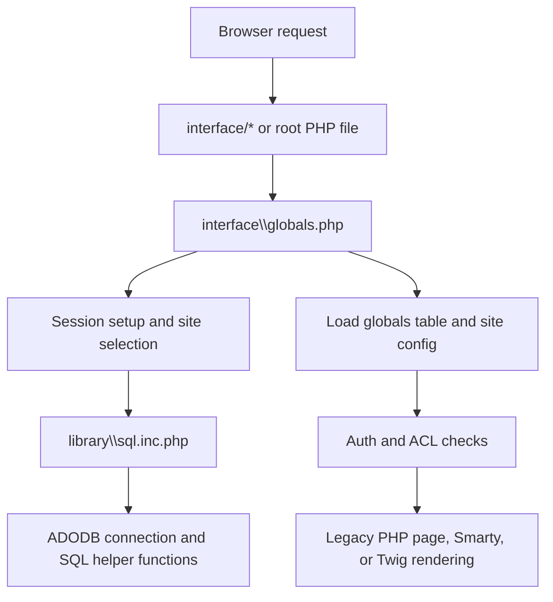
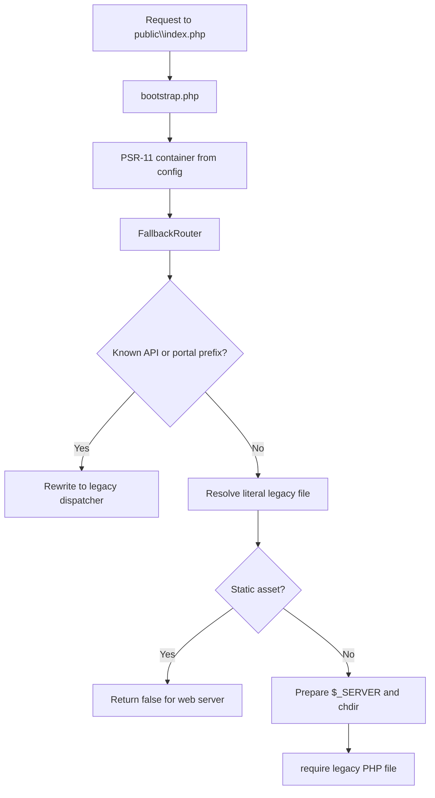
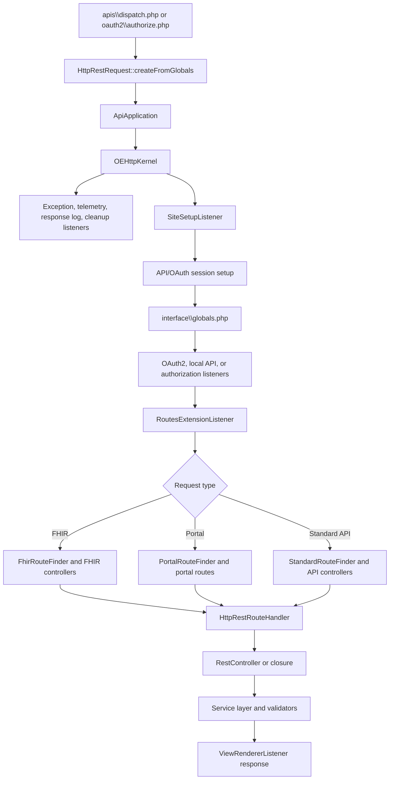

# OpenEMR Architecture

This document describes the architecture visible in this repository. OpenEMR is a large PHP monolith in transition: it still has substantial legacy procedural code, while newer work adds namespaced services, REST/FHIR controllers, Symfony components, Doctrine DBAL/ORM plumbing, event dispatching, and PSR interfaces.

## Quick Orientation

The application is organized around several runtime surfaces:

- Browser EHR UI: legacy PHP entry points under `interface`, `library`, `controllers`, and `templates`.
- REST, FHIR, portal API, and OAuth2 endpoints: `apis\dispatch.php`, `oauth2\authorize.php`, `_rest_routes.inc.php`, `apis\routes`, and `src\RestControllers`.
- Patient portal: `portal` and portal routes in the API stack.
- Module system: Laminas modules and custom modules under `interface\modules`.
- CLI and installation tooling: `bin\console`, `cli`, `setup.php`, `sql_upgrade.php`, and `sql_patch.php`.
- Storage: MySQL/MariaDB via legacy ADODB helpers and newer Doctrine DBAL services, plus site-scoped filesystem document storage and optional CouchDB/remote document storage.

The codebase uses Composer PSR-4 autoloading for `OpenEMR\` classes in `src`, classmap loading for `library\classes`, and Composer `files` autoload entries for widely used legacy helper functions.

## Directory Map

| Path | Role |
| --- | --- |
| `src` | Modern namespaced PHP code under `OpenEMR\`. Contains services, REST controllers, FHIR model/services, common infrastructure, events, validators, core wrappers, payment integrations, and newer compatibility/BC layers. |
| `library` | Legacy procedural helpers and legacy classes. Contains SQL wrappers, auth helpers, Smarty plugins, JavaScript, ESign, MedEx, validation helpers, and classmap-loaded classes such as `Document`, `Prescription`, and `Controller`. |
| `interface` | Main browser UI. Contains login, tabs shell, patient chart pages, scheduling, forms, reports, billing screens, modules, themes, and many direct PHP entry points. |
| `controllers` | Legacy controller classes used by `controller.php`, for example document, pharmacy, prescription, insurance, and practice settings controllers. |
| `templates` | Twig, Smarty, HTML, PHP, and JS templates for UI rendering. Twig is the modern template layer; Smarty remains for legacy controllers. |
| `apis` | API dispatcher and route maps. Requests enter `apis\dispatch.php` and are routed through the API application/kernel. |
| `oauth2` | OAuth2 authorization entry point. It uses the same API application stack as REST/FHIR. |
| `portal` | Patient portal UI and portal-specific PHP entry points. |
| `interface\modules` | Runtime module system. Includes Laminas modules in `zend_modules` and custom modules in `custom_modules`. |
| `gacl` | Legacy phpGACL implementation used for access control. |
| `sql` | Baseline schema, historical upgrade scripts, patch DSL, and seed/example data. |
| `db` | Emerging Doctrine Migrations configuration and migration scaffolding. Not yet the primary schema-change path. |
| `sites` | Site-specific configuration and storage. `sites\default` contains `sqlconf.php`, `config.php`, documents, images, and related per-site data. |
| `public` | Public static entry assets, images, certificates, SMART styles, and generated/copy-installed frontend assets. |
| `config` | New PSR-11 container configuration, environment mappings, database service wiring, PSR mappings, and asset registry YAML. |
| `tests` | PHPUnit, isolated tests, API/E2E/service tests, PHPStan custom rules, fixtures, and JavaScript tests. |
| `docker` and `ci` | Development, production, and CI container definitions. |
| `ccdaservice`, `ccr`, `sphere`, `custom`, `contrib`, `Documentation`, `swagger` | Supporting integrations, legacy clinical document code, custom scripts, contribution assets, docs, and OpenAPI UI/assets. |

## Main Runtime Flows

### Classic Browser UI

Most browser UI requests are still direct PHP file entry points.



Important pieces:

- `interface\globals.php` is the central legacy bootstrap. It sets path globals, starts or reuses the active session, identifies the site, creates the `Kernel`, opens the database connection through `library\sql.inc.php`, loads the `globals` table, loads `sites\default\config.php`, and initializes modules/events.
- `library\auth.inc.php` performs core login/logout/session validation for authenticated browser pages.
- `index.php` selects the site and redirects either to `interface\login\login.php` or `setup.php`.
- `interface\main\tabs\main.php` is the main authenticated UI shell. It loads the tabbed application frame, menu JSON, JavaScript view models, global JS state, CSRF tokens, telemetry/background service hooks, and Twig fragments.

### Front Controller Compatibility Path

`public\index.php` is a newer front controller path. It uses `bootstrap.php`, builds a PSR-11 container, creates a PSR-7 request, and delegates to `OpenEMR\BC\FallbackRouter`.



`src\BC\FallbackRouter.php` blocks direct access to sensitive paths such as `config`, `db`, `sql`, `src`, `tests`, `vendor`, `sites\*\documents`, dotfiles, package files, templates, and config files. It rewrites major prefixes like `/apis`, `/oauth2`, `/meta/health`, `/portal/patient`, and Laminas public module assets to their historical dispatchers.

This is a compatibility bridge. New fully modern routes are expected to sit in front of the fallback path over time.

### Legacy `controller.php` Dispatcher

`controller.php` loads `interface\globals.php`, constructs `Controller` from `library\classes\Controller.class.php`, and dispatches either:

- explicit URLs such as `controller.php?controller=document&action=view`, or
- older positional query-parameter URLs.

The controller dispatcher currently whitelists legacy `C_*` classes from `controllers`, applies a small controller ACL map, supports process actions, and renders through Smarty.

### REST, FHIR, Portal API, and OAuth2

REST, FHIR, portal API, and OAuth2 requests enter through `apis\dispatch.php` or `oauth2\authorize.php`.



Key classes:

- `src\RestControllers\ApiApplication.php` wires the Symfony `HttpKernel` event listeners.
- `src\Core\OEHttpKernel.php` extends Symfony `HttpKernel` and exposes the shared `OEGlobalsBag`, event dispatcher, and logger.
- `src\RestControllers\Subscriber\SiteSetupListener.php` extracts the site from the URL, starts API/OAuth/core session bridges, loads `interface\globals.php`, and ensures OAuth keys exist.
- `src\RestControllers\Subscriber\RoutesExtensionListener.php` selects standard, portal, or FHIR route finders.
- `src\Common\Http\HttpRestRouteHandler.php` matches route patterns, performs scope/security checks, sets `_controller`, and lets the kernel run the controller.
- `src\RestControllers\Subscriber\ViewRendererListener.php` converts controller output to JSON, text, Symfony responses, or PSR-7 responses.

Routes are defined in:

- `_rest_routes.inc.php`
- `apis\routes\_rest_routes_standard.inc.php`
- `apis\routes\_rest_routes_fhir_r4_us_core_3_1_0.inc.php`
- `apis\routes\_rest_routes_portal.inc.php`

### CLI

There are two CLI paths:

- `bin\console` is the established Symfony command runner path. It can either load full `interface\globals.php` or use `--skip-globals` for commands that do not need the database.
- `cli` is an experimental newer CLI using `bootstrap.php`, the PSR-11 container, Doctrine Migrations commands, Doctrine ORM commands, and the experimental `install` command.

## Core Runtime State

### Globals and `OEGlobalsBag`

Legacy OpenEMR code relies heavily on `$GLOBALS`. `src\Core\OEGlobalsBag.php` wraps `$GLOBALS` in a Symfony `ParameterBag`-style API. Its `set()` method writes through to `$GLOBALS` for backward compatibility, while typed getters reduce repeated casting in newer code.

Important global state includes:

- path values such as `webserver_root`, `web_root`, `fileroot`, `srcdir`, `template_dir`, and `OE_SITE_DIR`
- active site and site web root
- the active ADODB connection in `adodb` and raw handle in `dbh`
- application settings loaded from the `globals` table
- event dispatcher and `Kernel`
- asset paths, theme paths, localization flags, and per-user settings

This makes `interface\globals.php` the main compatibility boundary between legacy request state and newer namespaced code.

### Kernel and Event Dispatcher

`src\Core\Kernel.php` holds:

- Symfony DI `ContainerBuilder` setup for event dispatching
- an event dispatcher service
- project, web, asset, template, and site path helpers
- a minimal `isDev()` environment check

Events are used across newer features and module extension points. Examples include patient creation/update events, menu events, Twig environment events, module load events, REST security events, patient document storage events, and main tabs render events.

### Service Access

There are two service access patterns:

- Legacy/static bridge: `src\BC\ServiceContainer.php` provides static access to logger, crypto, PSR-17 factories, clock, and storage manager. It supports overrides for tests/modules.
- New PSR-11 container: `bootstrap.php` loads config from `config`, including `config\services.php`, `config\database.php`, `config\psr.php`, `config\env.php`, and `config\app.php`.

The newer container is not fully integrated into all web requests yet. It is used by `public\index.php` and the experimental `cli` path.

## Domain and Application Components

### Service Layer

Most API/business logic is in `src\Services`. Many services extend `src\Services\BaseService.php`, which:

- binds the service to a database table
- discovers table fields with `QueryUtils::listTableFields()`
- builds insert/update/select SQL fragments
- provides search helper integration
- exposes the event dispatcher and optional active session

Examples:

- `PatientService` for `patient_data`
- `EncounterService` for `form_encounter`
- `AppointmentService` for `openemr_postcalendar_events`
- `DocumentService` for `documents`
- `FacilityService`, `PractitionerService`, `InsuranceService`, `ConditionService`, `ImmunizationService`, `ProcedureService`, and others

Validators under `src\Validators` validate input and return `ProcessingResult` objects for many API-facing operations.

### REST Controllers

`src\RestControllers` maps route closures to controller classes. Standard controllers handle CRUD/search operations for patients, encounters, practitioners, facilities, insurance, prescriptions, appointments, documents, procedures, messages, version, users, and background services.

FHIR controllers live under `src\RestControllers\FHIR` and delegate to FHIR services in `src\Services\FHIR`. The FHIR model classes under `src\FHIR\R4` are generated or vendored R4 resource/data-type classes, with OpenEMR-specific domain helpers under `src\FHIR\DomainModels` and export helpers under `src\FHIR\Export`.

### Legacy Browser Components

The browser UI remains file-oriented:

- `interface\patient_file` contains chart/demographic/patient summary flows.
- `interface\main` contains the logged-in shell, calendar, reminders, messages, and tabs.
- `interface\forms` contains many encounter form implementations.
- `interface\billing`, `interface\reports`, `interface\practice`, `interface\super`, and related directories contain administrative and billing workflows.
- `library` exposes shared helper functions and older classes used by these pages.

### Forms

OpenEMR encounter forms are distributed across:

- schema tables named `form_*` in `sql\database.sql`
- UI/runtime code under `interface\forms`
- form registration rows in the `forms` table
- service/model wrappers for newer forms under `src\Common\Forms` or `src\Services`

The codebase contains both generic form infrastructure and specialty-specific forms.

### Patient Portal

Portal UI code lives in `portal`. Portal API routes are in `apis\routes\_rest_routes_portal.inc.php` and are selected by `PortalRouteFinder`. Portal sessions are separated from core sessions by `SessionWrapperFactory` and `HttpSessionFactory`.

### Modules

There are two module models:

- Laminas modules in `interface\modules\zend_modules\module`
- Custom modules in `interface\modules\custom_modules`

`src\Core\ModulesApplication.php` loads enabled modules from the `modules` database table, boots Laminas MVC modules, bridges the Symfony event dispatcher into the Laminas service manager, and loads custom module bootstraps named `openemr.bootstrap.php`.

Custom modules can use `src\Core\ModulesClassLoader.php` to register PSR-4 namespaces or classmaps without modifying the root Composer autoloader.

The module tables include `modules`, `openemr_modules`, `module_acl_*`, `module_configuration`, `modules_settings`, `modules_hooks_settings`, and `openemr_module_vars`.

### Authorization and Sessions

Core browser auth is in `library\auth.inc.php` and `src\Common\Auth\AuthUtils.php`.

ACL checks use `src\Common\Acl\AclMain.php`, which wraps the legacy phpGACL model in `gacl` and tables such as `gacl_acl`, `gacl_aco`, `gacl_aro`, groups, and mapping tables.

Sessions are centralized through `src\Common\Session\SessionWrapperFactory.php`, which chooses core, portal, setup, API, or OAuth session behavior depending on request context. API requests use `HttpSessionFactory` and can bridge back to the core session for local API calls with `APICSRFTOKEN`.

OAuth2/OpenID Connect code is under `src\Common\Auth\OpenIDConnect`, with token/client tables such as `api_token`, `api_refresh_token`, `oauth_clients`, and `oauth_trusted_user`.

## Storage Architecture

OpenEMR uses multiple storage mechanisms, each scoped differently.

### Site-Scoped Configuration

OpenEMR supports multi-site installations. Site identity is resolved from request/session state and stored in the session as `site_id`.

Each site directory, for example `sites\default`, contains:

- `sqlconf.php`: database connection credentials for that site
- `config.php`: site-specific runtime settings, including the document repository path
- `documents`: protected document storage root
- `images`, `LBF`, and other site-local configuration/assets

`src\BC\DatabaseConnectionOptions.php` loads `sites\<site>\sqlconf.php` and converts the credentials to Doctrine DBAL connection parameters. It also discovers optional MySQL SSL certificate files under `sites\<site>\documents\certificates`.

### Relational Database

The primary persistence layer is MySQL/MariaDB. `sql\database.sql` defines the baseline schema, with hundreds of tables. Major table families include:

- core identity and users: `users`, `users_secure`, `groups`, `facility`, `facility_user_ids`, `users_facility`
- patient record: `patient_data`, `patient_history`, `person`, `contact`, `contact_address`, `contact_telecom`, `contact_relation`, `person_patient_link`
- encounters and clinical forms: `form_encounter`, `forms`, many `form_*` tables, `lists`, `lists_medication`, `issue_encounter`, `immunizations`, `history_data`
- scheduling: `openemr_postcalendar_events`, `openemr_postcalendar_categories`
- documents: `documents`, `categories`, `categories_seq`, `categories_to_documents`, legal document tables, `onsite_documents`
- billing and claims: `billing`, `claims`, `payments`, EDI/X12 tables, procedure order/result/provider tables
- ACL: `gacl_*` tables plus module ACL tables
- APIs and OAuth: `api_log`, `api_token`, `api_refresh_token`, `oauth_clients`, `oauth_trusted_user`
- auditing/logging: `log`, `extended_log`, `audit_master`, `audit_details`, `log_comment_encrypt`, `api_log`
- modules: `modules`, `openemr_modules`, `module_*`, `modules_*`, `openemr_module_vars`
- portal: `onsite_*`, `patient_access_onsite`, `patient_portal_menu`, `patient_settings`
- identifiers: `uuid_registry`, `uuid_mapping`
- questionnaire/SDOH: `questionnaire_repository`, `questionnaire_response`, `form_questionnaire_assessments`, `form_history_sdoh`

### Legacy SQL Access

`library\sql.inc.php` is the legacy SQL gateway. It loads `library\sqlconf.php`, creates an ADODB `mysqli_log` connection using `DatabaseConnectionFactory`, stores it in `$GLOBALS['adodb']['db']`, and exposes global helper functions:

- `sqlStatement()`
- `sqlStatementNoLog()`
- `sqlStatementThrowException()`
- `sqlQuery()`
- `sqlInsert()`
- `sqlFetchArray()`
- many related helpers

Most legacy and service-layer code still uses these helpers.

`src\Common\Database\QueryUtils.php` contains the newer static implementation behind many of those wrappers. It centralizes record fetching, insert helpers, table/column escaping, last insert id, affected rows, and ADODB execution behavior.

### Newer DBAL and ORM Plumbing

`config\database.php` wires:

- `ConnectionManager`
- `Doctrine\DBAL\Connection`
- `DatabaseConnectionOptions`
- Doctrine Migrations `DependencyFactory`
- Doctrine ORM `EntityManager`

`src\Common\Database\ConnectionManager.php` lazily manages named connection types:

- `Main`: default read/write connection
- `NonAudited`: separate connection for audit operations and bootstrapping paths that must avoid audit middleware/circular dependencies

Doctrine ORM metadata is configured for `src\Entities`, but `src\Entities\README.md` makes clear this is transitional and currently minimal. New ORM entities should map only fields needed for the current task and avoid automatic relations for now.

### Schema Changes and Upgrades

Current schema evolution is split:

- `sql\database.sql`: full baseline schema
- `sql\*.sql`: historical version-to-version upgrade scripts and seed/reference files
- `sql\patch.sql`: patch DSL for conditional table/column/index/row changes
- `setup.php`, `sql_upgrade.php`, `sql_patch.php`: legacy setup and upgrade runners
- `db\Migrations`: emerging Doctrine Migrations path

`db\README.md` states Doctrine Migrations are not fully integrated yet, so routine schema changes still need to follow the active project guidance instead of assuming migrations are the primary path.

### Document and File Storage

Document metadata is stored in the `documents` table. Binary content can be stored in multiple ways:

- local filesystem under the current site's document repository
- CouchDB when `document_storage_method` selects CouchDB
- remote/offsite storage through the `PatientDocumentStoreOffsite` event hook

`library\classes\Document.class.php` coordinates this behavior:

- computes safe relative document paths
- generates UUID-backed filenames
- writes local files under the repository configured in `sites\default\config.php`
- records document URLs, path depth, MIME type, size, owner, expiration, document UUID, and hash metadata
- optionally creates thumbnails
- supports drive encryption and CouchDB encryption
- relates documents to categories through `categories_to_documents`

For local storage, `sites\default\config.php` sets:

```php
$GLOBALS['oer_config']['documents']['repopath'] = $GLOBALS['OE_SITE_DIR'] . "/documents/";
$GLOBALS['oer_config']['documents']['repository'] = $GLOBALS['oer_config']['documents']['repopath'];
```

For CouchDB storage, `library\classes\CouchDB.class.php` reads CouchDB host/user/password/database settings from globals, supports optional TLS and client certificates under the site documents certificate directory, and stores document payloads by CouchDB document id.

For future abstraction, `src\Services\Storage` contains:

- `Location`: site-relative storage locations, currently `Documents`
- `ManagerInterface` and `Manager`: registry of Flysystem filesystems by location
- `CacheDirectory`: secure local cache directory helper for libraries that cannot use Flysystem

The newer storage manager is wired in `config\services.php` and `src\BC\ServiceContainer.php`, mapping `Location::Documents` to `sites\<site>\documents` by default.

### UUIDs and Cross-System Identifiers

`src\Common\Uuid\UuidRegistry.php` creates timestamp-first COMB UUIDs and tracks UUID use in `uuid_registry`. `uuid_mapping` supports mapped external/FHIR identifiers. The registry knows many core tables and can backfill missing UUIDs for supported records.

UUIDs are used heavily for API/FHIR identifiers, document drive filenames, CouchDB ids, and future offline/remote-support scenarios.

### Auditing and Logs

Auditing is a first-class storage concern:

- ADODB execution is wrapped by the `mysqli_log` driver and can log SQL events.
- `src\Common\Logging\EventAuditLogger.php` writes application events to log tables and can write ATNA audit events when enabled.
- Audit logging uses a separate DBAL connection so logging does not interfere with the main audited connection path.
- `api_log` records API request/response data through the API kernel subscribers.
- `log`, `extended_log`, `audit_master`, `audit_details`, and `log_comment_encrypt` support core and extended audit/history use cases.

## Frontend and Rendering

OpenEMR's frontend is a blend of server-rendered PHP, Twig, Smarty, jQuery-era JavaScript, Angular 1.x, Bootstrap 4, and compiled Sass themes.

### Templates

- Twig setup is centralized in `src\Common\Twig\TwigContainer.php`.
- Twig templates live primarily in `templates`.
- Smarty remains in use through legacy controllers and plugins under `library\smarty` and `library\smarty_legacy`.
- `library\classes\Controller.class.php` extends Smarty for legacy `controller.php` workflows.

Twig autoescaping is currently disabled in `TwigContainer`, so escaping must be deliberate in templates and helpers.

### Assets

`config\config.yaml` is the central asset registry. It maps asset names to base paths, JS files, CSS files, autoload behavior, RTL variants, modules, and special options.

`package.json` and `gulpfile.js` define frontend build behavior:

- dependencies are copied/installed into `public\assets`
- Sass sources under `interface\themes` compile into `public\themes`
- theme variants include base, compact, color, tabs, miscellaneous, and RTL outputs

The main UI shell in `interface\main\tabs\main.php` injects global JavaScript state and loads tab/menu JavaScript from `interface\main\tabs\js`.

### Navigation

Main menu definitions live under `interface\main\tabs\menu\menus`. Menu extension events live under `src\Menu`, including `MenuEvent` and patient menu event classes. Modules can alter menus through event listeners.

## Extensibility Points

OpenEMR supports extension through several mechanisms:

- Symfony events from the core kernel and service layer
- module bootstraps in `interface\modules\custom_modules\<module>\openemr.bootstrap.php`
- Laminas modules loaded from `interface\modules\zend_modules\module`
- REST API route maps and route finder classes
- FHIR service locators and resource services
- Smarty and Twig extensions/plugins
- legacy include hooks and global configuration
- document remote-storage event listeners
- menu update/restrict events

The extension model is powerful but mixed. New extension code should prefer events, services, typed configuration, and explicit dependencies instead of new global state.

## Tests and Quality Gates

Testing lives under `tests`:

- `tests\Tests\Api`: API controller tests
- `tests\Tests\Services`: service/data access tests
- `tests\Tests\Unit`: unit tests
- `tests\Tests\E2e`: browser tests using Symfony Panther
- `tests\Tests\Isolated`: database-free host tests, including Twig compilation and render tests
- `tests\js`: Jest tests
- `tests\PHPStan\Rules`: custom PHPStan rules

Common commands:

```powershell
composer phpunit-isolated
npm run test:js
npm run lint:js
npm run stylelint
composer phpstan
composer phpcs
```

Docker-based development and full test execution are described in `docker\development-easy\README.md`, `CONTRIBUTING.md`, and `tests\README.md`.

## Deployment and Local Development

Primary development paths are Docker-based:

```powershell
Set-Location docker\development-easy
docker compose up --detach --wait
```

The app normally runs at:

- `http://localhost:8300/`
- `https://localhost:9300/`

Default development login is `admin` / `pass` when using the documented development stack.

Production/development container definitions are under `docker`, with CI variants under `ci`.

## Transitional Architecture Notes

The most important architectural fact is that there is no single pure framework boundary yet. OpenEMR is actively bridging between:

- direct PHP file routing and a future front-controller model
- `$GLOBALS` and `OEGlobalsBag`
- static service locators and constructor-injected services
- ADODB helpers and Doctrine DBAL/ORM
- Smarty/PHP templates and Twig
- legacy module patterns and event-driven modules
- local filesystem document storage and abstract Flysystem/remote storage

When adding new code:

- prefer `src` and namespaced classes for new application logic
- use `QueryUtils` or existing service patterns for database access unless an area already has a stronger local abstraction
- use `OEGlobalsBag` typed getters instead of direct `$GLOBALS` reads where legacy compatibility is required
- use events for cross-module extension points
- keep direct superglobal reads at entry points and parse them early
- keep schema changes aligned with the current project migration guidance
- avoid introducing new global state or direct service construction inside business logic

## Where To Look First

| Task | Start here |
| --- | --- |
| Web request bootstrap | `interface\globals.php` |
| Modern front-controller bootstrap | `public\index.php`, `bootstrap.php`, `src\BC\FallbackRouter.php` |
| REST/FHIR routing | `apis\dispatch.php`, `_rest_routes.inc.php`, `src\RestControllers\ApiApplication.php` |
| Standard API behavior | `apis\routes\_rest_routes_standard.inc.php`, `src\RestControllers`, `src\Services` |
| FHIR behavior | `apis\routes\_rest_routes_fhir_r4_us_core_3_1_0.inc.php`, `src\RestControllers\FHIR`, `src\Services\FHIR`, `src\FHIR` |
| Database helpers | `library\sql.inc.php`, `src\Common\Database\QueryUtils.php` |
| DB connection configuration | `src\BC\DatabaseConnectionOptions.php`, `config\database.php`, `sites\default\sqlconf.php` |
| Document storage | `library\classes\Document.class.php`, `src\Services\Storage`, `sites\default\config.php` |
| Authorization | `library\auth.inc.php`, `src\Common\Acl\AclMain.php`, `gacl` |
| Sessions | `src\Common\Session\SessionWrapperFactory.php`, `src\Common\Http\HttpSessionFactory.php` |
| Main UI shell | `interface\main\tabs\main.php`, `interface\main\tabs\js`, `interface\main\tabs\menu` |
| Templates | `templates`, `src\Common\Twig\TwigContainer.php`, `library\smarty` |
| Modules | `src\Core\ModulesApplication.php`, `interface\modules` |
| Assets/themes | `config\config.yaml`, `gulpfile.js`, `interface\themes`, `public\assets` |
| Tests | `tests\README.md`, `tests\Tests\README.md` |
