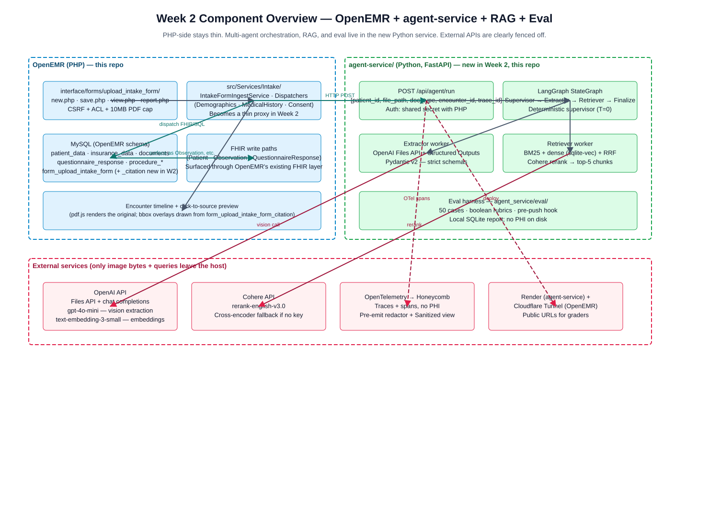
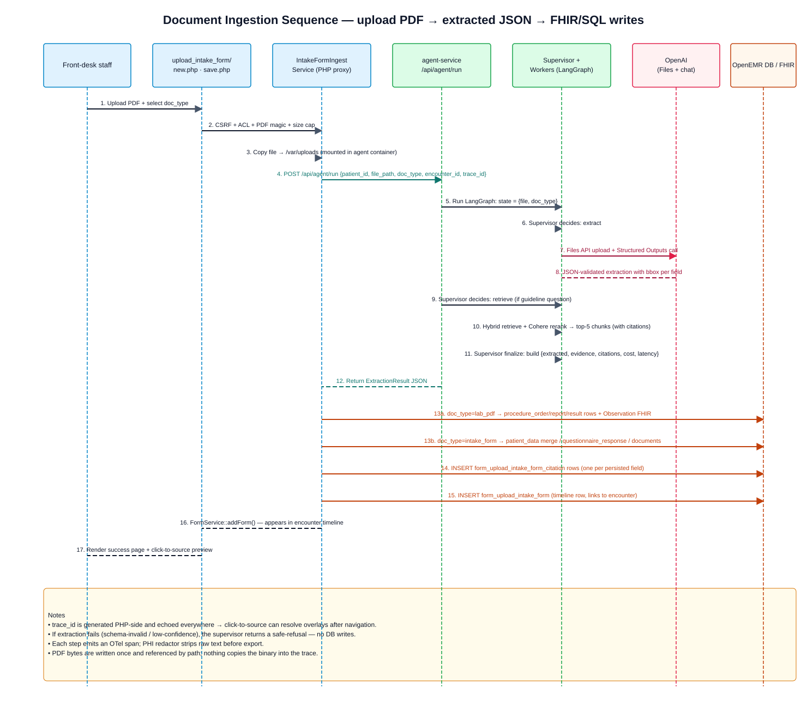
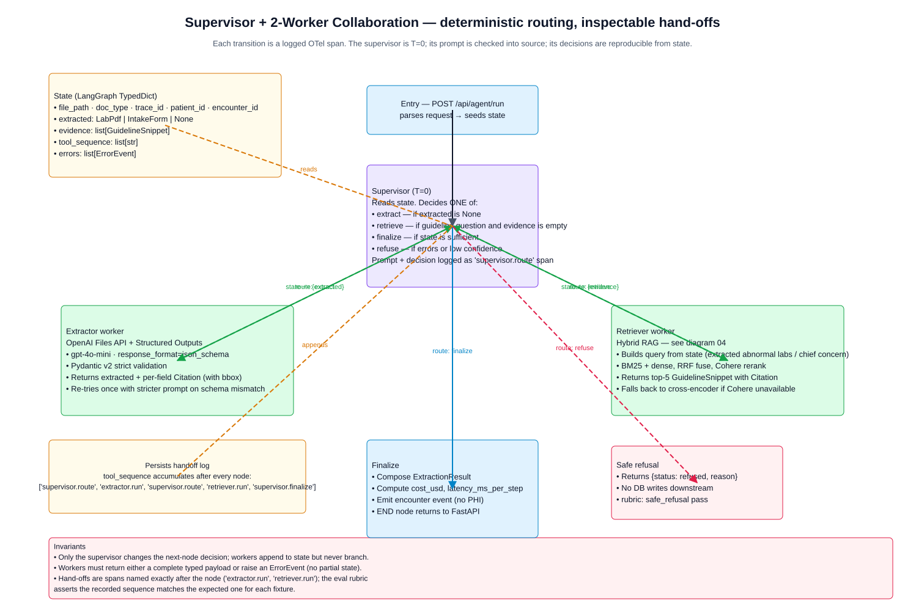
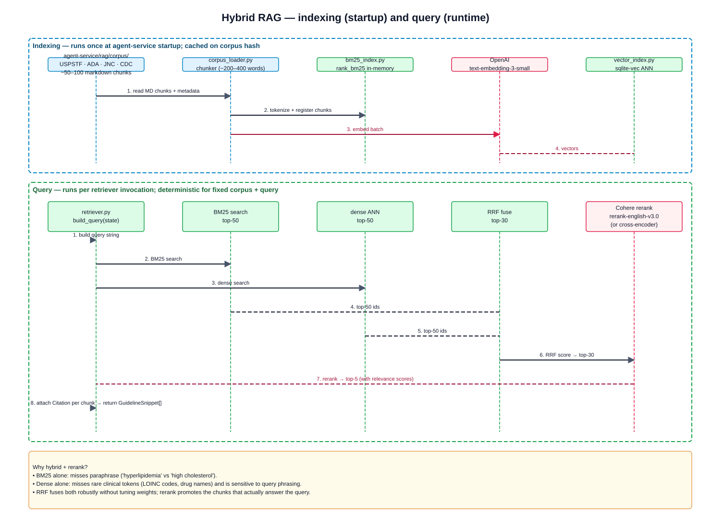
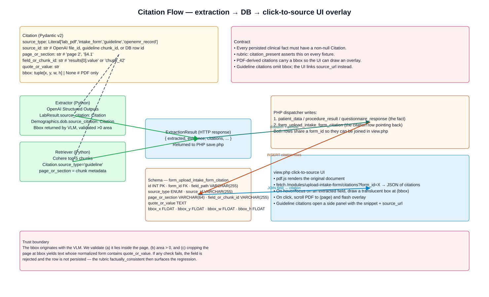
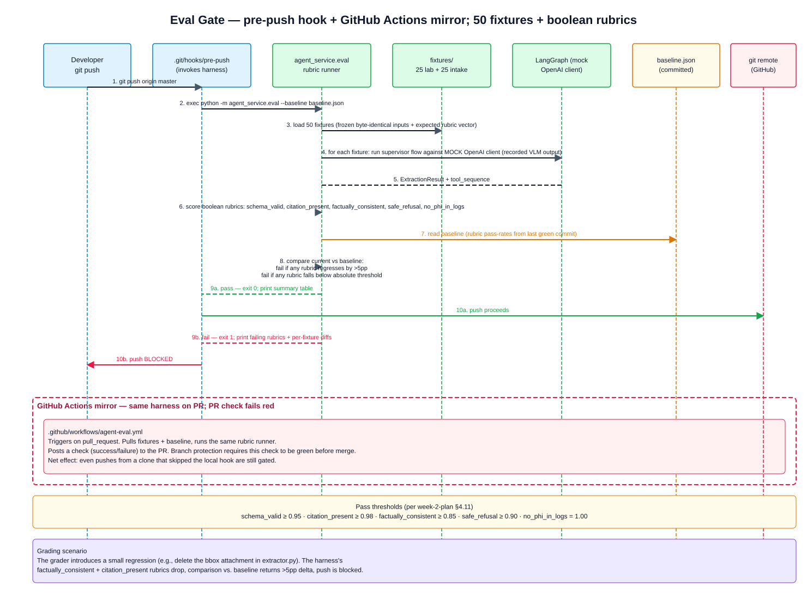
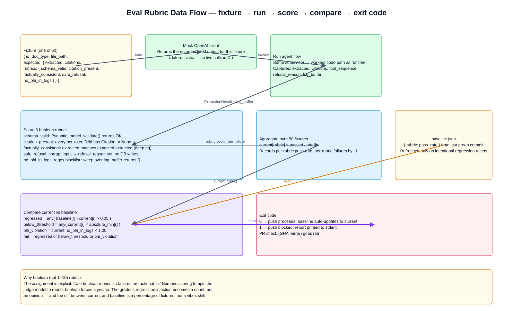
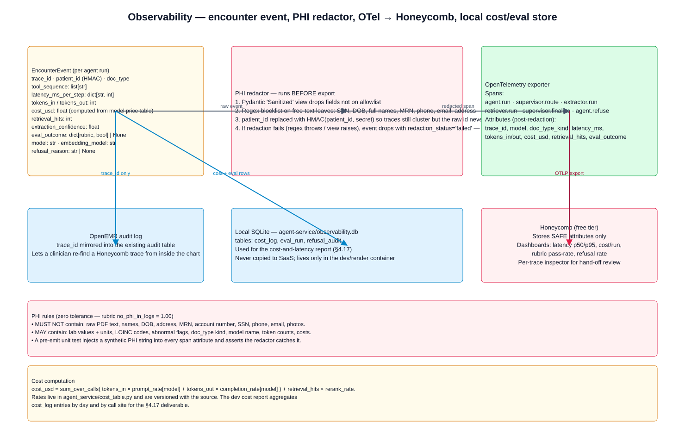
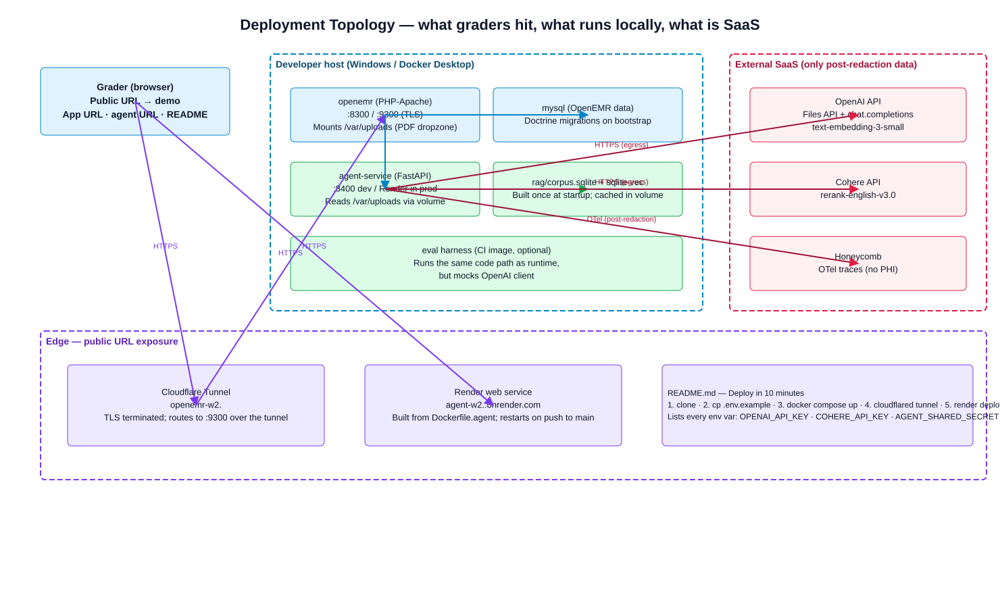

# W2 Architecture — AgentForge Clinical Co-Pilot, Week 2

> Multimodal evidence agent: ingest a lab PDF and a patient intake form, route
> work through a supervisor + 2-worker LangGraph, retrieve guideline evidence
> with hybrid RAG, return a grounded answer with per-field citations, and gate
> quality with a 50-case rubric CI.

This document is the architecture defense for the Week 2 deliverable. The
narrative source for *what* we build and *when* lives in
[`week-2-plan.md`](week-2-plan.md); this document is the *how* — the
component shapes, the sequences, and the contracts that hold them together.

Every section embeds at least one diagram from
[`diagrams/`](diagrams/). The diagrams are checked in as drawio XML; open
them at <https://app.diagrams.net> by *File → Open from → Device*.

---

## 1. Overview

The Week 2 agent ingests a lab PDF and an intake form uploaded inside an
OpenEMR encounter, extracts a strict-schema JSON payload with per-field
citations, retrieves guideline evidence with a hybrid (BM25 + dense + Cohere
rerank) retriever, routes the work through a supervisor + 2-worker LangGraph,
and returns a grounded answer that the encounter UI surfaces alongside the
original document with a click-to-source bounding-box overlay. Quality is
gated by a 50-case boolean-rubric CI that fires both as a local pre-push hook
and as a PR check on GitHub.

The goal is narrow and durable: two document types, two workers, one
regression gate. Anything broader is explicitly out of scope (see
[`week-2-plan.md` §6](week-2-plan.md#6-out-of-scope-explicitly)).

---

## 2. Component diagram



| Component | Lives in | Responsibility |
|-----------|----------|----------------|
| OpenEMR (PHP) | this repo | Encounter UI, document storage, FHIR write paths, CSRF/ACL gate |
| `interface/forms/upload_intake_form/` | this repo (extended in W2) | Upload form (`new.php`), ingest entry point (`save.php`), encounter timeline (`report.php`), click-to-source preview (`view.php`) |
| `src/Services/Intake/` | this repo (becomes thin proxy) | Validates the upload, calls `agent-service`, dispatches to `patient_data` / `procedure_*` / `questionnaire_response` / `documents` |
| `agent-service/` (Python, FastAPI) | this repo (new in Week 2) | Multi-agent orchestration; one HTTP entry point `POST /api/agent/run` |
| Supervisor / Extractor / Retriever | Python | LangGraph nodes (one supervisor, two workers) |
| RAG (BM25 + dense + Cohere rerank) | Python | Guideline retrieval with `Citation`-tagged snippets |
| OpenEMR MariaDB/MySQL | Railway project | Existing OpenEMR database; durable token, cost, latency, and eval records |
| OpenAI API | external | Vision extraction (Files API + Structured Outputs); embeddings (`text-embedding-3-small`) |
| Cohere API | external | Live/dev rerank (`rerank-english-v3.0`); deterministic fake reranker in CI/tests; cross-encoder only if Cohere access breaks |
| OpenTelemetry → Honeycomb | external | Sanitized demo traces/spans only; no durable records or raw PHI |
| Eval harness | this repo (new — `agent-service/eval/`) | 50-case rubric runner; pre-push hook + GitHub Actions mirror |

The PHP side stays thin: it owns CSRF/ACL/upload validation and the writes
into OpenEMR's existing tables. Multi-agent orchestration, RAG, and eval all
live in the Python service. This boundary is the simplest one that lets us
reuse Week-1 OpenEMR primitives (auth, audit, FHIR layer) without dragging
LangGraph into PHP.

---

## 3. Document ingestion flow (sequence)



The path from "user clicks Upload" to "extracted facts visible in the
encounter timeline":

1. User uploads a PDF inside the encounter form (`new.php`).
2. `save.php` validates CSRF + ACL (`admin|super`) + the PDF magic bytes +
   the 10 MB cap (`UPLOAD_INTAKE_FORM_MAX_BYTES`, already enforced today).
3. `save.php` copies the file to a shared volume (`/var/uploads`) that the
   `agent-service` container also mounts.
4. `save.php` POSTs to `agent-service` at `/api/agent/run` with
   `{patient_id, file_path, doc_type, encounter_id, trace_id}`. The
   `trace_id` is generated in PHP and echoed everywhere downstream so the
   click-to-source UI can resolve overlays after a page navigation.
5. The supervisor decides: extract → (optionally retrieve) → finalize. See
   §4 for the worker graph details.
6. The Extractor worker calls OpenAI Files API + Structured Outputs and
   returns a Pydantic-validated payload with per-field `Citation`s (each
   carrying a `bbox` for PDF-derived facts).
7. `save.php` receives the JSON response and dispatches to type-specific
   write paths:
   - `lab_pdf` → `procedure_order` + `procedure_report` + `procedure_result`
     rows (surfaced via OpenEMR's existing FHIR layer as `Observation`).
   - `intake_form` → `patient_data` merge (fill-only-empty),
     `questionnaire_response`, or the `documents` module per
     [intake-forms-plan §3.4](intake-forms-plan.md).
8. For every persisted field, a row is inserted into
   `form_upload_intake_form_citation` (new table — see §6) so the UI can
   later resolve `field_path` → bounding box.
9. A row is inserted into `form_upload_intake_form` and registered with
   `FormService::addForm()` so the upload appears in the encounter timeline.

If extraction fails (Pydantic validation rejects, confidence < threshold,
supervisor refusal), no DB writes happen. The user gets a clear error and
the rubric `safe_refusal` records a pass.

---

## 4. Worker graph (multi-agent collaboration)



The graph is a `LangGraph` `StateGraph` with three working nodes plus
entry/exit:

- **Supervisor** — the only node that decides the next branch. It is
  *deterministic* (`temperature=0`), reads the entire state, and emits one
  of `extract`, `retrieve`, `finalize`, or `refuse`. The prompt is checked
  into the source so reviewers can read it. Every routing decision is
  recorded as a `supervisor.route` OTel span with the input state shape and
  the chosen branch.
- **Extractor** — calls OpenAI Files API + Structured Outputs with the
  schema for the current `doc_type`. Returns a Pydantic-validated object or
  raises an `ErrorEvent`. On schema mismatch it retries once with a
  stricter prompt that surfaces the validator's complaint, then gives up.
- **Retriever** — runs the hybrid RAG path (see §5). The query is
  composed from state — for a lab PDF it includes abnormal flag + test
  name, for an intake form it includes chief concern + medications.
  Returns `list[GuidelineSnippet]` with `Citation` metadata.

The hand-off contract is small and explicit:

- Workers append to state but never branch. Only the supervisor decides
  `next_node`.
- Workers return either a complete typed payload or an `ErrorEvent`. There
  is no partial state — a half-extracted lab is treated as a refusal.
- The `tool_sequence` field in state accumulates after every node (e.g.
  `["supervisor.route", "extractor.run", "supervisor.route",
  "retriever.run", "supervisor.finalize"]`). The eval rubric asserts the
  recorded sequence matches the expected one for each fixture, which is
  how we keep the supervisor from becoming a black box.

This shape directly answers the assignment's "common pitfalls" warning:
the supervisor is inspectable because its decisions are deterministic
given state, its prompt is reviewable, and the rubric verifies hand-off
order on every fixture.

---

## 5. RAG design (sequence)



Hybrid retrieval has two phases:

**Indexing (startup)**
1. `corpus_loader.py` walks `agent-service/rag/corpus/` (USPSTF, ADA, JNC,
   CDC excerpts; 50 curated public guideline chunks to start, adding more
   only if eval coverage exposes retrieval gaps).
2. `bm25_index.py` builds an in-memory `rank_bm25` index over tokenized
   chunks.
3. `vector_index.py` calls OpenAI `text-embedding-3-small` in a single
   batch and stores the vectors in a SQLite table indexed with
   `sqlite-vec` for ANN. This SQLite file is a rebuildable retrieval index,
   not the durable observability or eval store.
4. The combined index is hashed on corpus version; a re-run with the same
   corpus is a no-op.

**Query (runtime)**
1. `retriever.py` builds a query string from state (the abnormal lab
   tests + units, or the chief concern + a primary medication).
2. BM25 returns top-50 chunk ids; the dense ANN returns top-50 chunk ids.
3. The two lists are fused with Reciprocal Rank Fusion (`RRF`) into a
   single top-30.
4. The top-30 is reranked by Cohere `rerank-english-v3.0` in live/dev.
   CI/tests use a deterministic fake reranker. A local cross-encoder via
   `sentence-transformers` is reserved for Cohere access failures.
5. The top-5 chunks are returned. Each chunk carries its `Citation`
   (source URL, section, published date, chunk id) so the answer can be
   grounded back to the corpus.

Why hybrid + rerank? BM25 alone misses paraphrase ("hyperlipidemia" vs
"high cholesterol"); dense alone misses rare clinical tokens (LOINC codes,
drug names) and is sensitive to query phrasing. RRF fuses both robustly
without weight tuning, and the rerank promotes the chunks that actually
answer the query. For a small corpus the rerank is the highest-leverage
component — without it, the top-5 is dominated by the dense retriever's
nearest neighbors regardless of clinical relevance.

---

## 6. Citation contract



The Citation model — Pydantic v2:

```python
from typing import Literal

class Citation(BaseModel):
    source_type: Literal["lab_pdf", "intake_form", "guideline", "openemr_record"]
    source_id: str            # OpenAI file_id, guideline chunk_id, or DB row id
    page_or_section: str      # "page 2", "§4.1"
    field_or_chunk_id: str    # "results[0].value" or "chunk_42"
    quote_or_value: str
    bbox: tuple[float, float, float, float] | None  # PDF only; None for guideline
```

Every persisted clinical fact carries a non-null `Citation`. The rubric
`citation_present` enforces this on every fixture.

The flow:

1. The Extractor returns a `LabPdf` or `IntakeForm` whose every leaf field
   has a `source_citation: Citation`. PDF-derived citations carry a
   `bbox`. The bbox is validated server-side: it must fall inside the
   page, have positive area, and the page region cropped at that bbox
   must contain the `quote_or_value` after normalization. Failures reject
   the field — they do not silently degrade.
2. The Retriever returns `GuidelineSnippet`s whose every chunk has a
   `Citation` with `source_type='guideline'` (no `bbox`).
3. PHP's dispatcher writes the fact (e.g. into `procedure_result`) and a
   parallel row into `form_upload_intake_form_citation`:

   ```sql
   CREATE TABLE form_upload_intake_form_citation (
     id           INT AUTO_INCREMENT PRIMARY KEY,
     form_id      INT NOT NULL,
     field_path   VARCHAR(255) NOT NULL,
     source_type  ENUM('lab_pdf','intake_form','guideline','openemr_record') NOT NULL,
     source_id    VARCHAR(255) NOT NULL,
     page_or_section VARCHAR(64),
     field_or_chunk_id VARCHAR(255),
     quote_or_value TEXT,
     bbox_x       FLOAT, bbox_y FLOAT, bbox_w FLOAT, bbox_h FLOAT,
     KEY (form_id)
   ) ENGINE=InnoDB;
   ```

4. `view.php` renders the original PDF with `pdf.js` and fetches the
   citations for the form. On hover/focus on an extracted field, it draws
   a translucent box at `(bbox_x, bbox_y, bbox_w, bbox_h)`. Click scrolls
   the PDF to the page and flashes the overlay. Guideline citations open
   a side panel showing the snippet + a link to `source_url`.

This is the assignment's "visual PDF bounding-box overlay" requirement,
implemented as a join on `form_id` rather than a bespoke ORM mapping —
small, debuggable, easy to query from the eval harness.

---

## 7. Eval gate



The gate is a small Python harness invoked from a Git pre-push hook and
mirrored as a GitHub Actions check.

The flow:

1. `git push` runs `.git/hooks/pre-push`, which execs
   `python -m agent_service.eval --baseline baseline.json`.
2. The harness loads 50 fixtures (25 lab PDFs from
   [`generate-lab-pdf.ps1`](generate-lab-pdf.ps1) + 25 intake forms from
   `generate-intake-form.ps1`). Each fixture is byte-identical from run
   to run (deterministic seeds; outputs frozen as binaries in
   `agent-service/eval/fixtures/`).
3. For each fixture the harness runs the supervisor flow against a
   *mock* OpenAI client. The mock returns the recorded VLM output for
   that fixture, so CI never makes a live call. The same code path as
   runtime is exercised — the mock plugs in at the OpenAI client
   boundary, not above the worker.
4. The harness scores 5 boolean rubrics per fixture:

   | Rubric | Definition |
   |--------|-----------|
   | `schema_valid` | Pydantic `.model_validate()` returns OK on the agent's payload |
   | `citation_present` | Every persisted field has `Citation != None` |
   | `factually_consistent` | The extracted payload matches the fixture's `expected.extracted` (deep equality on the fields the fixture asserts) |
   | `safe_refusal` | When the input is corrupt/empty, the agent refuses; no DB writes are attempted |
   | `no_phi_in_logs` | Trace lines + log buffer contain no DOB/SSN/full name/address/MRN/phone/email |

5. The harness aggregates over 50 fixtures into `current[rubric] =
   passed/total`, then compares to `baseline.json` (committed):

   - **fail** if any rubric regresses by **>5 percentage points** vs.
     baseline
   - **fail** if any rubric falls below the **absolute threshold** below
   - **fail** if `no_phi_in_logs` < 1.00 (zero tolerance)

6. Pass thresholds (per [week-2-plan §4.11](week-2-plan.md#411--eval-gate--50-cases-boolean-rubrics-pr-blocking)):

   | Rubric | Threshold |
   |--------|-----------|
   | `schema_valid` | ≥ 0.90 |
   | `citation_present` | ≥ 0.90 |
   | `factually_consistent` | ≥ 0.80 |
   | `safe_refusal` | ≥ 0.80 |
   | `no_phi_in_logs` | = 1.00 |

7. Exit 0 → push proceeds; baseline auto-updates to current. Exit 1 →
   push is blocked, a per-rubric/per-fixture diff is printed to stderr,
   and the GitHub Actions mirror posts a red check on the PR.

The rubric data flow is captured separately in
[`diagrams/09-eval-rubric-data-flow.svg`](diagrams/09-eval-rubric-data-flow.svg).



The grading scenario from the assignment ("we will introduce a small
regression and confirm your CI gate fails") is the design centroid: the
rubrics are boolean and deterministic, the fixtures are byte-identical, and
the comparison is a percentage of fixtures, not an opinion. A typical
injected regression (e.g. delete the bbox attachment in the Extractor)
drops `factually_consistent` and `citation_present` together, both by far
more than 5pp, and the push is blocked.

---

## 8. Observability



Per agent run the service emits one `EncounterEvent`:

| Field | Source |
|-------|--------|
| `trace_id` | UUID, generated PHP-side, echoed throughout, mirrored into the OpenEMR audit log so a clinician can re-find a Honeycomb trace from the chart |
| `tool_sequence` | LangGraph node names in order |
| `latency_ms_per_step` | OTel span durations |
| `tokens_in / tokens_out` | OpenAI `usage` object on each call |
| `cost_usd` | `tokens × model_price_table[model]` (versioned in `agent_service/cost_table.py`) |
| `retrieval_hits` | `len(rerank_top_k)` |
| `extraction_confidence` | from the schema's `extraction_confidence` field |
| `eval_outcome` | rubric pass-rate vector (CI runs only) |

Two-stop export:

- **Honeycomb** for sanitized demo traces/spans only. All attributes go
  through the redactor first; raw PHI and durable records never go to SaaS.
- **Existing OpenEMR MariaDB/MySQL** for durable token, cost, latency, eval,
  and refusal records used by the cost + latency report (assignment §4.17).

PHI rules — zero tolerance, enforced by `no_phi_in_logs = 1.00`:

- **MUST NOT** contain raw PDF text, names, DOB, address, MRN, account
  number, SSN, phone, email, or screenshots.
- **MAY** contain lab values + units, LOINC codes, abnormal flags, doc
  type kind, model name, token counts, and costs.
- The redactor is a Pydantic `Sanitized` view (drops fields off the
  allowlist) plus a regex blocklist on free-text leaves. Failure to
  redact drops the event and emits `redaction_status='failed'` rather
  than risk a partial leak.
- `patient_id` is HMAC'd with a per-deployment secret before export so
  traces still cluster but the raw id never lands SaaS-side.
- A pre-emit unit test injects a synthetic PHI string into every span
  attribute and asserts the redactor catches it.

---

## 9. Reuse from intake-forms feature

The Week 2 work inherits a meaningful slice of the intake-forms feature
that already shipped to master (commits b702b632, 656c05dea, a8ad78a28).
What changes:

| Surface | Reuse | New for Week 2 |
|---------|-------|----------------|
| Encounter form `interface/forms/upload_intake_form/` | Reused; `Lab Report` added to dropdown | Click-to-source preview pane in `view.php` |
| `OpenEMR\Services\Intake` (PHP) | Reused for write-side dispatch; becomes a thin proxy to agent-service | Lab-PDF dispatch (`procedure_*`); citation-row insert |
| `generate-intake-form.ps1` and `generate-lab-pdf.ps1` | Drive the 25 + 25 fixtures | — |
| OpenAI client (`OpenEMR\Services\Intake\OpenAi\OpenAIClient`) | Stays for any PHP-only schema validation tests | Multi-agent orchestration moves into Python; the *agent* OpenAI client is in agent-service, not in PHP |
| `form_upload_intake_form` table + Doctrine migration | Reused as-is | New parallel table `form_upload_intake_form_citation` (§6) |
| Cypress / Panther E2E | Reused for the upload UI flow | Extended to cover lab upload, click-to-source overlay, and the supervisor hand-off log |
| Documentation (`intake-forms.md`, `intake-forms-plan.md`) | Stay; this `W2_ARCHITECTURE.md` is the new file required by the assignment | — |

For the comprehensive reuse matrix see
[`week-2-plan.md` §2](week-2-plan.md#2-reuse-from-intake-forms-planmd).

What categorically does not reuse: the hybrid RAG corpus and indexes, the
supervisor + worker graph, the click-to-source overlay logic, the 50-case
eval suite + boolean rubrics + PR-blocking hook, and the cost / latency /
retrieval-hits observability pipe.

---

## 10. Risks and tradeoffs

| Risk | Likelihood | Impact | Mitigation |
|------|-----------|--------|------------|
| **VLM hallucination** — the model invents a field label or overstates confidence on a noisy scan | High | High (silent wrong record) | Strict Pydantic schemas with `extraction_confidence`; per-field `Citation` with bbox validation (bbox must fall inside page, area > 0, cropped page region must contain the quote); rubric `factually_consistent` asserted against fixture metadata, not against another LLM |
| **Cost balloon during eval** — 50 cases × N model calls run nightly add up | Medium | Medium | `gpt-4o-mini` for extraction; mock the OpenAI client in CI (the `agent_service.eval` harness uses recorded VLM outputs and never calls the live API); cache by file-hash for human-driven runs; daily cost dashboard from existing OpenEMR MariaDB/MySQL observability tables |
| **Supervisor as black box** — the orchestration is a closed prompt nobody can debug | Medium | High | Supervisor is `T=0`; its prompt + branching rules are checked into source; every routing decision is a `supervisor.route` OTel span with the input state shape; the eval rubric asserts the recorded `tool_sequence` matches the expected one per fixture |
| **PHI leak to SaaS** — Honeycomb or OpenAI receives a name / DOB / MRN | Low (with redactor) | Catastrophic | Pre-emit redactor (Pydantic `Sanitized` view + regex blocklist); `patient_id` HMAC'd before export; rubric `no_phi_in_logs = 1.00` (zero tolerance); pre-emit unit test injects synthetic PHI into every span attribute |
| **Lenient eval gate** — the rubric passes the regression the grader injects | Medium | High (assignment fails) | Boolean rubrics (no fuzzy 1–10 judging); deterministic fixtures with byte-identical inputs; `factually_consistent` is deep-eq against the fixture, not LLM-as-judge; an internal regression-injection test (delete bbox attachment) is part of the eval suite so we know the gate fires |
| **Deployment surface for grader** — grader cannot find the public URL or the env vars are wrong | Medium | Medium | One-page "Deploy in 10 minutes" section in README listing every env var (`OPENAI_API_KEY`, `COHERE_API_KEY`, `AGENT_SHARED_SECRET`, `HONEYCOMB_API_KEY`); OpenEMR, agent-service, and the existing MariaDB/MySQL service live in the same Railway project; the submitted deployed link is Railway |
| **Cohere outage** — rerank API is unavailable during live/dev retrieval | Low | Medium | Deterministic fake reranker covers CI/tests; cross-encoder fallback via `sentence-transformers` is used only if Cohere access breaks, and the rubric `factually_consistent` still passes if the top-5 still contains the right chunk |

---

## 11. Tradeoffs explicitly chosen



These are the decisions where there was a real fork in the road, and we
picked one branch. Each one is justified short-term (Week 2 ships in five
days) and most have a clear migration path if they need to scale.

### 11.1 Python + LangGraph (vs. PHP-only)

The Week 1 agent already lives in PHP. Adding LangGraph to PHP would
require porting the framework or duct-taping a custom state machine. The
assignment explicitly names LangGraph and the OpenAI Agents SDK as
expected orchestration frameworks; both are first-class in Python. We
keep PHP for what it's good at (CSRF, ACL, OpenEMR's ORM, FHIR layer)
and put the agent loop in a separate Python service. The cost is one
extra deploy target; the benefit is no framework duct-tape and an
inspectable `StateGraph` out of the box.

### 11.2 BM25 + sqlite-vec (vs. Elasticsearch + Pinecone)

The corpus target is the minimally viable lower bound: 50 curated public
guideline chunks. Elasticsearch and Pinecone are designed for millions.
`rank_bm25` is in-memory pure Python; `sqlite-vec` is a single SQLite
extension used only for the rebuildable retrieval index. If eval coverage
exposes retrieval gaps, we add more chunks; if the corpus grows past 10k
chunks, the vector index would move to a hosted store.

### 11.3 Cohere rerank (vs. local cross-encoder)

Cohere's `rerank-english-v3.0` is available for live/dev retrieval and is
a calibrated, well-trained reranker we do not have to operate. CI/tests
use a deterministic fake reranker so they do not depend on an external
API. The cross-encoder fallback exists only for Cohere access failures.
Cost-per-query is small and the quality lift on a 30-candidate list is
the highest-leverage RAG component.

### 11.4 Honeycomb (vs. self-hosted Tempo)

Self-hosting Grafana Tempo would avoid SaaS traces, but the Week 2
decision is narrower: Honeycomb receives only sanitized demo traces/spans.
Durable token, cost, latency, and eval records stay in the existing
OpenEMR MariaDB/MySQL database. We need the redactor anyway (the
assignment forbids logging raw PHI to SaaS, and the OpenEMR audit trail
also benefits from sanitized attributes). The redactor's `Sanitized` view
is the load-bearing contract; the backend is interchangeable.

### 11.5 Railway deployment

The submitted deployed link is Railway. OpenEMR, `agent-service`, and the
existing MariaDB/MySQL service live in the same Railway project so the
grader has one managed deployment surface. The repo can be submitted
through GitLab because this fork has both GitLab and GitHub remotes;
GitHub remains useful for the Actions mirror.

### 11.6 Single-PDF-per-call (vs. batch)

The HTTP entry point handles one document per call. Real clinics often
upload a packet — a faxed lab + a faxed med list + an intake form
together. Supporting batch in Week 2 would mean orchestrating multiple
extractor invocations and reasoning about partial failures. The
assignment explicitly warns against trying to support "five document
types before two work reliably." Batch is on the post-Week-2 road map;
Week 2 ships single-PDF and gets it right.

---

## 12. Clinical Co-Pilot Migration: Ownership Contract

This section records the post-migration PHP/Python ownership contract for the
Clinical Co-Pilot work tracked in
[`Clinical Co-Pilot Migration to Python Sidecar.md`](Clinical%20Co-Pilot%20Migration%20to%20Python%20Sidecar.md).
It is the architectural authority for what runs where after the cutover and the
boundary the rest of the migration plan implements against.

### 12.1 Python ownership

The Python sidecar (`agent-service/`) owns the entire clinical reasoning loop:

- Agent and tool selection ("LLM chooses tools" — see §12.3).
- Retrieval orchestration over OpenEMR records and the guideline corpus.
- Prompt assembly and structured-output schemas.
- Answer generation and response shaping.
- Verifier and refusal logic.
- Eval harness, fixtures, and rubric scoring.
- All model-provider calls (OpenAI, Cohere, future providers).

After cutover, PHP performs none of these. The migration plan's M13–M16 land
the agent loop, response shaping, verifier, and observability in Python; M24
removes the PHP equivalents.

### 12.2 PHP ownership

PHP (OpenEMR) owns only the boundary concerns it is best at:

- UI rendering inside the encounter and chart views.
- Authenticated OpenEMR route entry (the `/agent/...` controllers).
- CSRF and session checks.
- Current patient and encounter resolution from the authenticated session.
- Minting of the signed `CopilotRunContext` that carries scoped authority into
  the sidecar.

PHP becomes a thin proxy: it authenticates the request, resolves scope from
the session, mints a signed run context, and forwards to the sidecar. It does
not assemble prompts, choose tools, call models, or shape clinical answers.

### 12.3 LLM tool choice within a runtime-allowed registry

Inside the sidecar, the LLM chooses tools — that is the point of the
migration. But tool choice is not unbounded. Every tool the model can name
must be present in the runtime-allowed tool registry for the current
`CopilotRunContext`. The registry is policy-derived (intent, role, scope), not
model-derived. A tool name returned by the LLM that is not in the
runtime-allowed set is rejected by the executor before any side effect.

This preserves the "LLM chooses tools" property without giving the model
authority over what tools exist.

### 12.4 The model never supplies authority

The model produces tool *arguments*, but it never supplies authoritative
identifiers, queries, or destinations. Specifically, the model does not
provide an authoritative `patient_id`, `encounter_id`, `document_id`, raw SQL,
file path, or write destination. Each of these is sourced from the signed
`CopilotRunContext` that PHP minted at the route boundary.

The executor injects scope from the run context and rejects any tool call
whose arguments attempt to override it. This is the load-bearing safety
property: even a fully compromised prompt cannot widen the patient scope or
redirect a write, because the authoritative values never enter the model's
context as something it could change.

---

## Appendix — diagram index

| File | Type | Section |
|------|------|---------|
| [`diagrams/01-component-overview.svg`](diagrams/01-component-overview.svg) | component | §2 |
| [`diagrams/02-seq-document-ingestion.svg`](diagrams/02-seq-document-ingestion.svg) | sequence | §3 |
| [`diagrams/03-collab-supervisor-workers.svg`](diagrams/03-collab-supervisor-workers.svg) | collaboration | §4 |
| [`diagrams/04-seq-rag.svg`](diagrams/04-seq-rag.svg) | sequence | §5 |
| [`diagrams/05-component-citations.svg`](diagrams/05-component-citations.svg) | component | §6 |
| [`diagrams/06-seq-eval-gate.svg`](diagrams/06-seq-eval-gate.svg) | sequence | §7 |
| [`diagrams/07-component-observability.svg`](diagrams/07-component-observability.svg) | component | §8 |
| [`diagrams/08-deployment-topology.svg`](diagrams/08-deployment-topology.svg) | deployment | §11 (referenced) |
| [`diagrams/09-eval-rubric-data-flow.svg`](diagrams/09-eval-rubric-data-flow.svg) | data flow | §7 (companion to 06) |

The `.drawio` source files remain checked-in alongside the SVGs — open them at
<https://app.diagrams.net> via *File → Open from → Device* for interactive editing.
