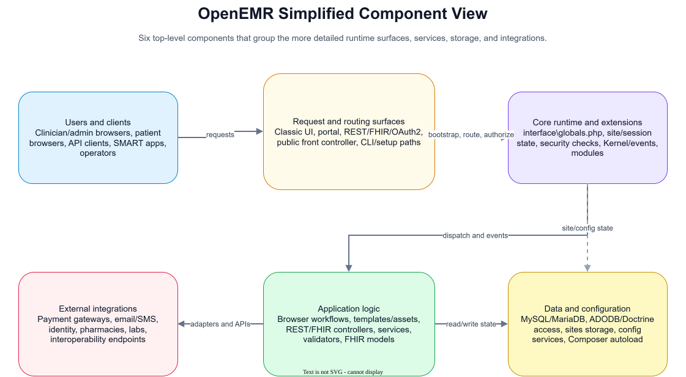
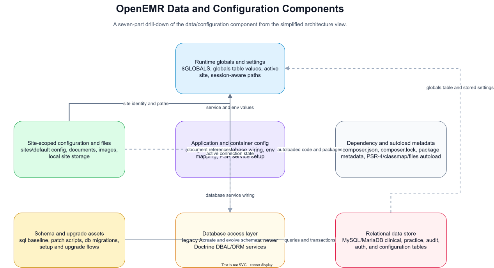
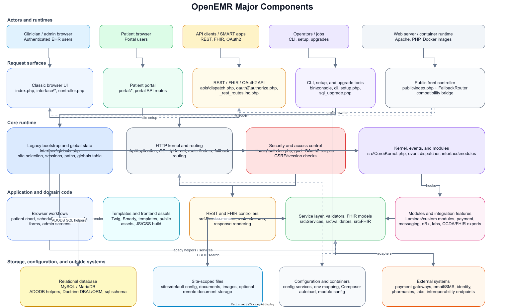

# OpenEMR Major Components

## Simplified Component View

This six-component view groups the system into users and clients, request routing, core runtime behavior, application logic, data/configuration, and external integrations. It is intended as the quickest orientation for the system.

Source file: [openemr-simplified-components.drawio](openemr-simplified-components.drawio)

## Data And Configuration View

This drill-down expands the data/configuration component into seven sub-components: runtime globals and settings, site-scoped files, application/container configuration, dependency metadata, the database access layer, schema/upgrade assets, and the relational database.

Source file: [openemr-data-configuration-components.drawio](openemr-data-configuration-components.drawio)

## Detailed Component View

This diagram summarizes the major runtime surfaces and shared components visible in this repository. OpenEMR is a PHP application with a large legacy browser UI, newer REST/FHIR/OAuth2 routing, a patient portal, CLI/setup tooling, and a gradual move toward namespaced service and container infrastructure.

The main compatibility boundary is `interface\globals.php`. Classic browser pages, portal flows, many CLI commands, and the API site setup path use it to establish the active site, session state, path globals, database access, global settings, and module/event hooks.

The API path enters through `apis\dispatch.php` and `oauth2\authorize.php`, then runs through `ApiApplication`, `OEHttpKernel`, route finders, security checks, REST/FHIR controllers, services, validators, and response rendering. The newer `public\index.php` path uses `FallbackRouter` as a bridge back into historical dispatchers and literal PHP entry points.

Data and configuration are split between MySQL/MariaDB, site-scoped files under `sites`, Composer/config-driven service wiring under `config`, and external systems for payments, messaging, pharmacies, labs, and interoperability.

Source file: [openemr-major-components.drawio](openemr-major-components.drawio)
