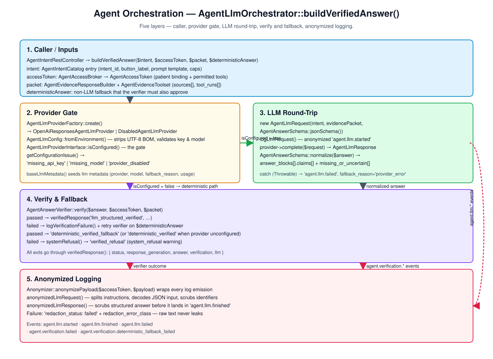
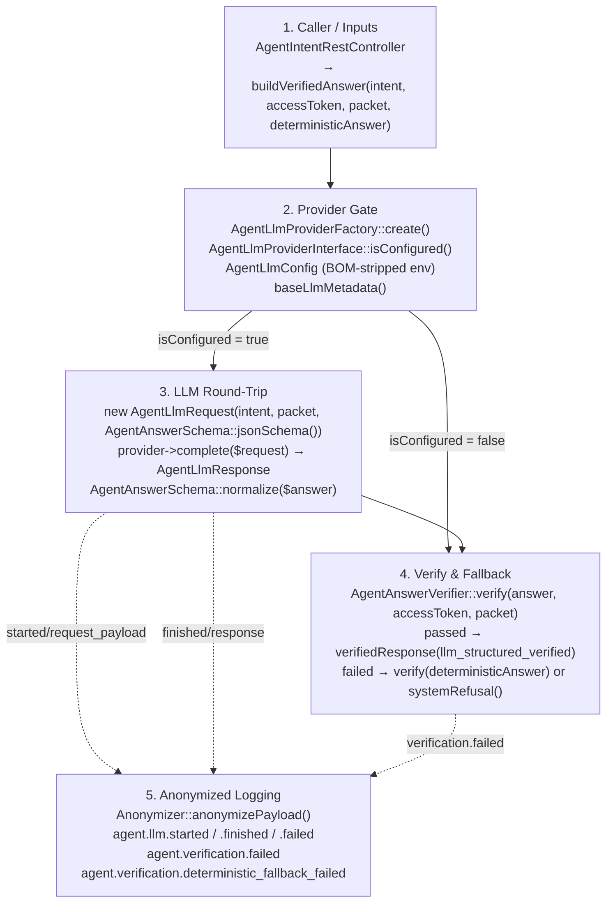

# Agent Orchestration

Five layers describing how the agent turns an authorized intent into a
verified answer. The whole flow lives in
[`AgentLlmOrchestrator::buildVerifiedAnswer()`](../src/Services/Agent/AgentLlmOrchestrator.php:47).

## Component Diagram

Source: [agent-orchestration.drawio](agent-orchestration.drawio).

## 1. Caller / Inputs

[`AgentIntentRestController`](../src/Common/Http/Rest/Controller/Agent/AgentIntentRestController.php)
constructs the deterministic answer and the bounded evidence packet for the
intent, then calls
[`AgentLlmOrchestrator::buildVerifiedAnswer()`](../src/Services/Agent/AgentLlmOrchestrator.php:47)
with four inputs:

| Argument | Source | Purpose |
| --- | --- | --- |
| `array $intent` | [`AgentIntentCatalog`](../src/Services/Agent/AgentIntentCatalog.php) entry | `intent_id`, `button_label`, prompt template, caps |
| [`AgentAccessToken $accessToken`](../src/Services/Agent/AgentAccessToken.php) | [`AgentAccessBroker`](../src/Services/Agent/AgentAccessBroker.php) | patient binding + permitted tools/data classes |
| `array $packet` | [`AgentEvidenceResponseBuilder`](../src/Services/Agent/AgentEvidenceResponseBuilder.php) + [`AgentEvidenceToolset`](../src/Services/Agent/Evidence/AgentEvidenceToolset.php) | `sources[]`, `tool_runs[]`, `request_id`, normalized excerpts |
| `array $deterministicAnswer` | response builder | non-LLM answer used as the verified fallback |

## 2. Provider Gate

The orchestrator decides whether to involve the LLM at all.

- [`AgentLlmProviderFactory::create()`](../src/Services/Agent/Llm/AgentLlmProviderFactory.php)
  returns either [`OpenAiResponsesAgentLlmProvider`](../src/Services/Agent/Llm/OpenAiResponsesAgentLlmProvider.php)
  or [`DisabledAgentLlmProvider`](../src/Services/Agent/Llm/DisabledAgentLlmProvider.php).
- [`AgentLlmConfig`](../src/Services/Agent/Llm/AgentLlmConfig.php) reads
  `AGENT_LLM_*` env values, strips UTF-8 BOMs, and reports
  `getConfigurationIssue()` on `missing_api_key`, `missing_model`, or
  `provider_disabled`.
- [`AgentLlmProviderInterface::isConfigured()`](../src/Services/Agent/Llm/AgentLlmProviderInterface.php)
  is the gate. If false, control jumps straight to layer 4 with the
  deterministic answer and a `fallback_reason` recorded in
  [`baseLlmMetadata()`](../src/Services/Agent/AgentLlmOrchestrator.php:132).

## 3. LLM Round-Trip

When the provider is configured, the orchestrator builds a structured request
and calls the model:

1. `new AgentLlmRequest(intent, evidencePacket, AgentAnswerSchema::jsonSchema())`
   — see [`AgentLlmRequest`](../src/Services/Agent/Llm/AgentLlmRequest.php)
   and [`AgentAnswerSchema::jsonSchema()`](../src/Services/Agent/Llm/AgentAnswerSchema.php).
2. [`logLlmRequest()`](../src/Services/Agent/AgentLlmOrchestrator.php:148)
   anonymizes and emits `agent.llm.started` plus a readable
   `agent.llm.request_readable` block.
3. [`provider->complete($request)`](../src/Services/Agent/Llm/OpenAiResponsesAgentLlmProvider.php)
   returns an [`AgentLlmResponse`](../src/Services/Agent/Llm/AgentLlmResponse.php)
   with the parsed `answer` and `usage` metadata.
4. [`AgentAnswerSchema::normalize()`](../src/Services/Agent/Llm/AgentAnswerSchema.php)
   coerces the raw payload to the contract that the verifier expects:
   `answer_blocks[].claims[]` plus `missing_or_uncertain[]`.

Any [`Throwable`](../src/Services/Agent/AgentLlmOrchestrator.php:88) here is
caught, logged as `agent.llm.failed` with the error class, and degrades to
the deterministic path.

## 4. Verify & Fallback

[`AgentAnswerVerifier::verify()`](../src/Services/Agent/Verification/AgentAnswerVerifier.php:34)
runs the LLM answer against the evidence packet and the access token. The
return shape is documented in the verification diagram. The orchestrator's
own decision tree:

| Path | Trigger | Outcome |
| --- | --- | --- |
| `llm_structured_verified` | LLM answer passes verifier | return verifier-approved LLM answer |
| `deterministic_verified_fallback` | LLM answer fails or provider errors, deterministic answer passes | log `agent.verification.failed` and return deterministic answer |
| `deterministic_verified` | provider not configured, deterministic answer passes | return deterministic answer with `fallback_reason` set |
| `verified_refusal` | even the deterministic answer fails verification | log `agent.verification.deterministic_fallback_failed`, return [`systemRefusal()`](../src/Services/Agent/AgentLlmOrchestrator.php:376) |

Every exit goes through
[`verifiedResponse()`](../src/Services/Agent/AgentLlmOrchestrator.php:358)
which packages `status`, `response_generation`, `answer`,
`verification`, and `llm` metadata.

## 5. Anonymized Logging

Two separate concerns share a single [`Anonymizer`](../src/Services/Agent/Anonymizer.php):

- **Request payload** — [`anonymizedLlmRequest()`](../src/Services/Agent/AgentLlmOrchestrator.php:168)
  decodes the JSON `input`, splits multi-line `instructions`, and runs
  `Anonymizer::anonymizePayload()` before logging. This is what makes raw
  identifiers safe to keep in `api_log`.
- **Response payload** — [`anonymizedLlmResponse()`](../src/Services/Agent/AgentLlmOrchestrator.php:336)
  scrubs the LLM's structured answer before it is attached to
  `agent.llm.finished`.

If anonymization itself fails, the log entry records
`redaction_status: failed` with the error class instead of the payload, so
the runtime never silently leaks an un-scrubbed message.
