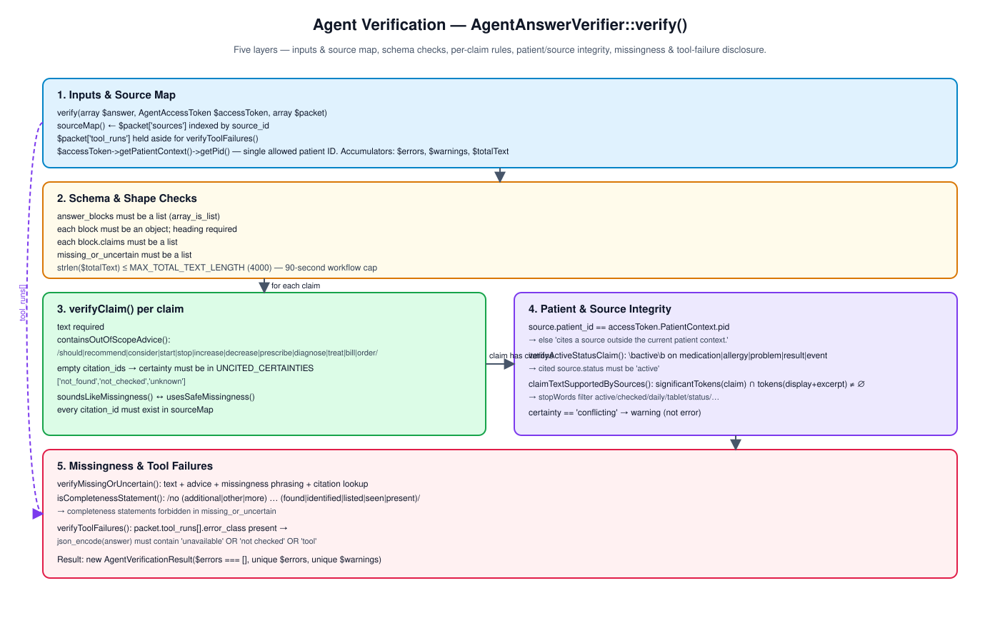
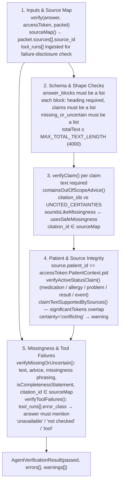

# Agent Verification

Five layers describing how
[`AgentAnswerVerifier::verify()`](../src/Services/Agent/Verification/AgentAnswerVerifier.php:34)
turns a candidate answer plus the evidence packet into an
[`AgentVerificationResult`](../src/Services/Agent/Verification/AgentVerificationResult.php).
The verifier is the gate that decides whether the orchestrator returns the
LLM answer, falls back to the deterministic answer, or refuses entirely.

## What Gets Verified

- **Shape & length** — answer matches the structured schema and stays under the 90-second workflow length cap.
- **Source grounding** — every claim cites a real packet source, the source belongs to the current patient, and the claim text is supported by what the source actually says.
- **Content safety** — no clinical advice, missingness uses safe phrasing, and tool failures are surfaced rather than hidden.
- **Certainty discipline** — uncited claims must declare an appropriate uncertainty; `conflicting` claims become warnings.

## Component Diagram

Source: [agent-verification.drawio](agent-verification.drawio).

## 1. Inputs & Source Map

Entry point:
[`verify(array $answer, AgentAccessToken $accessToken, array $packet)`](../src/Services/Agent/Verification/AgentAnswerVerifier.php:34).

The verifier first builds a working set from `$packet`:

- [`sourceMap()`](../src/Services/Agent/Verification/AgentAnswerVerifier.php:243)
  indexes `$packet['sources']` by `source_id`. Every citation in the answer
  must resolve here.
- `$packet['tool_runs']` is held aside for
  [`verifyToolFailures()`](../src/Services/Agent/Verification/AgentAnswerVerifier.php:215).
- `$accessToken->getPatientContext()->getPid()` is the single allowed
  patient ID for any cited source.

Two accumulators travel through the rest of the pass: `$errors`, `$warnings`,
plus a `$totalText` counter for the length cap.

## 2. Schema & Shape Checks

Before content checks, the verifier rejects malformed envelopes:

| Check | Condition | Error |
| --- | --- | --- |
| `answer_blocks` shape | not a list | `answer_blocks must be a list.` |
| block shape | not an object | `answer_blocks[i] must be an object.` |
| block heading | empty | `answer_blocks[i].heading is required.` |
| `claims` shape | not a list | `answer_blocks[i].claims must be a list.` |
| `missing_or_uncertain` shape | not a list | `missing_or_uncertain must be a list.` |
| total length | `strlen($totalText) > 4000` | `answer exceeds maximum length for the 90-second workflow.` |

The 4000-character cap (`MAX_TOTAL_TEXT_LENGTH`) ties the verifier to the
90-second clinician workflow target from
[`ARCHITECTURE.md`](../ARCHITECTURE.md).

## 3. verifyClaim() per claim

[`verifyClaim()`](../src/Services/Agent/Verification/AgentAnswerVerifier.php:98)
runs on every `answer_blocks[i].claims[j]` and applies five rules before
delegating patient/source integrity to layer 4:

1. **Text required** — empty `text` halts the claim with
   `path.text is required.`
2. **Out-of-scope advice** —
   [`containsOutOfScopeAdvice()`](../src/Services/Agent/Verification/AgentAnswerVerifier.php:337)
   matches `should | recommend | consider | start | stop | increase |
   decrease | prescribe | diagnose | treat | bill | place an order | order
   a`. Any hit emits `path contains out-of-scope clinical advice.`
3. **Citation requirement** — when `citation_ids` is empty, `certainty`
   must be one of `not_found`, `not_checked`, or `unknown`
   (`UNCITED_CERTAINTIES`). Otherwise: `path must cite checked evidence.`
4. **Safe missingness phrasing** —
   [`soundsLikeMissingness()`](../src/Services/Agent/Verification/AgentAnswerVerifier.php:345)
   detects `missing | not found | unavailable | not checked | unknown`;
   [`usesSafeMissingness()`](../src/Services/Agent/Verification/AgentAnswerVerifier.php:350)
   requires the phrasing `not found in checked evidence`, `not checked`,
   `unavailable`, or `unknown in checked evidence`.
5. **Citation lookup** — every `citation_id` must exist in `sourceMap`,
   else: `path cites unknown source_id <id>.`

## 4. Patient & Source Integrity

Once a claim has resolvable citations, the verifier inspects the cited
source rows:

- **Patient ownership** — if `source['patient_id']` is set and is not equal
  to `accessToken.getPatientContext()->getPid()`, the verifier emits
  `path cites a source outside the current patient context.` This is the
  same "exact user, exact patient, right now" rule the access broker
  enforces upstream.
- **Active-status check** —
  [`verifyActiveStatusClaim()`](../src/Services/Agent/Verification/AgentAnswerVerifier.php:285)
  triggers when claim text contains `\bactive\b` and the source type is
  one of `medication | allergy | problem | result | event`. Source must
  carry `status === 'active'`, else: `path claims an active <type> without
  an active cited source.`
- **Token support** —
  [`claimTextSupportedBySources()`](../src/Services/Agent/Verification/AgentAnswerVerifier.php:263)
  computes
  [`significantTokens()`](../src/Services/Agent/Verification/AgentAnswerVerifier.php:305)
  for the claim and each cited source's `display + excerpt`. A non-empty
  intersection is required; the stop-word list filters out generic
  vocabulary like `active`, `daily`, `tablet`, `record`, `status`.
- **Conflicting certainty** — `certainty === 'conflicting'` becomes a
  warning, not an error.

## 5. Missingness & Tool Failures

[`verifyMissingOrUncertain()`](../src/Services/Agent/Verification/AgentAnswerVerifier.php:171)
applies the same advice/missingness rules to the `missing_or_uncertain[]`
list and adds one extra:
[`isCompletenessStatement()`](../src/Services/Agent/Verification/AgentAnswerVerifier.php:358)
rejects sentences like *"no other allergies were identified"* — those
belong elsewhere; this list is for genuine gaps, not completeness claims.

[`verifyToolFailures()`](../src/Services/Agent/Verification/AgentAnswerVerifier.php:215)
closes the loop with the evidence packet: if any
`packet.tool_runs[].error_class` is present, the JSON-encoded answer must
contain at least one of `unavailable`, `not checked`, or `tool`. Otherwise
it emits `tool failure is hidden from the verified response.`

The pass returns a new
[`AgentVerificationResult`](../src/Services/Agent/Verification/AgentVerificationResult.php)
with `$errors === []` controlling `passed()`, plus deduplicated `errors`
and `warnings`.
