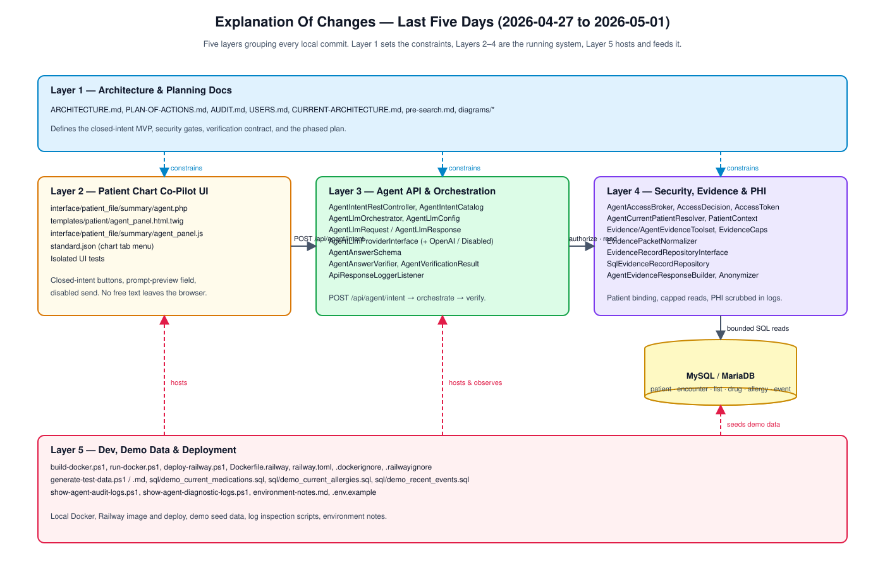
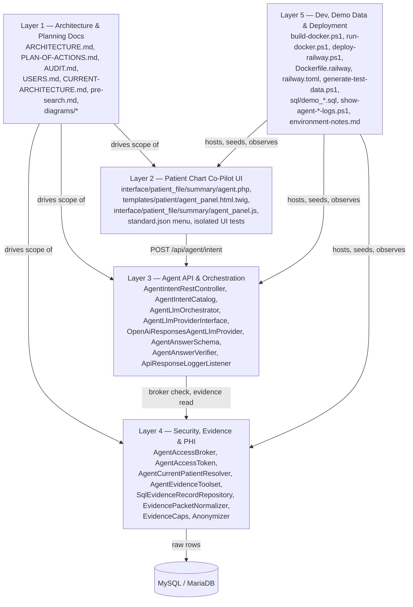

# Explanation Of Changes — Last Five Days

Window: 2026-04-27 through 2026-05-01.

This document organizes every local commit from the last five days into five
layers. The layers map directly to the structure laid out in
[`../ARCHITECTURE.md`](../ARCHITECTURE.md) and
[`../PLAN-OF-ACTIONS.md`](../PLAN-OF-ACTIONS.md): Phase 1 (closed UI and
endpoint), Phase 2 (access broker), Phase 3 (evidence tools), Phase 4
(anonymizer), and Phase 5 (LLM and verification) — wrapped by docs above and
ops/test-data tooling below.

## Component Diagram

Source: [explanation-of-changes.drawio](explanation-of-changes.drawio).

## Layer 1 — Architecture & Planning Docs

The week began by writing down what was being built and why before any code
landed. These artifacts now anchor the plan and are referenced by every other
layer.

| Commit | Subject |
| --- | --- |
| 2f8f022c1 | Add OpenEMR audit |
| 9772f6c1e | docs: add OpenEMR component diagram |
| 023d7e14b | Refine audit summary |
| 81d6f70b1 | docs: add simplified OpenEMR component diagram |
| d6a85dd89 | Restructure audit summary |
| c616e9700 | docs: add data configuration component diagram |
| 359b871c8 | Add clinical co-pilot user profiles |
| fb9ea58ca | docs: split data and configuration diagrams |
| 8500f2202 | Update user scope ambiguity rules |
| b4483f311 | Add clinical co-pilot architecture plan |
| c0b62365a | Clarify MVP scope in architecture summary |
| 97b5117ca | Incorporate pre-search architecture decisions |
| 9c1c842fa | Clarify agent access token lifecycle |
| 5053e598c | Add anonymizer component to agent architecture |
| 8dbba1466 | Clarify document parsing scope for MVP |
| bfe193ee3 | Show access token issuance in architecture diagram |
| 802b9ff86 | Update architecture anonymization notes |
| bc4f11e3b | Add architecture and assignment artifacts |
| 012ac64a2 | docs: split implementation plan from architecture |
| e9ddcbd1e | docs: order phase one implementation plan |
| 9341114c0 | docs: track plan status in tables |

Key files: [`ARCHITECTURE.md`](../ARCHITECTURE.md),
[`PLAN-OF-ACTIONS.md`](../PLAN-OF-ACTIONS.md), [`AUDIT.md`](../AUDIT.md),
[`USERS.md`](../USERS.md), [`CURRENT-ARCHITECTURE.md`](../CURRENT-ARCHITECTURE.md),
[`pre-search.md`](../pre-search.md), and the four prior diagrams in this
folder.

## Layer 2 — Patient Chart Co-Pilot UI

A closed-intent panel embedded in the patient chart. Per `ARCHITECTURE.md`,
the browser only sends server-defined intent IDs — no free text — and shows a
read-only prompt-preview so the user can see what will be sent to the LLM.

| Commit | Subject |
| --- | --- |
| 0ec6b0039 | feat: add phase one agent panel placeholders |
| ae4ceb3aa | feat: move co-pilot to patient chart tab |
| 88ff1b5a0 | feat: add co-pilot prompt preview |
| 7e1e3b7a4 | Update co-pilot loading state |
| b9814f61a | Hide empty agent missingness section |
| 2a0ea75d6 | fix: move agent panel script out of template |
| 3406bb08e | fix: load layout helpers for new patient forms |

Key files:
[`interface/patient_file/summary/agent.php`](../interface/patient_file/summary/agent.php),
[`templates/patient/agent_panel.html.twig`](../templates/patient/agent_panel.html.twig),
[`interface/patient_file/summary/agent_panel.js`](../interface/patient_file/summary/agent_panel.js),
[`interface/themes/tabs_style_full/menus/menu/menus/patient_menus/standard.json`](../interface/themes/tabs_style_full/menus/menu/menus/patient_menus/standard.json),
plus isolated panel tests under
[`tests/Tests/Isolated/Interface/`](../tests/Tests/Isolated/Interface/).

## Layer 3 — Agent API & Orchestration

The server-side path that turns an intent button click into a verified
response: REST endpoint → intent catalog → orchestrator → LLM provider →
structured-output verifier. The catalog owns prompts and per-intent caps; the
orchestrator owns the call sequence; the verifier rejects any answer the
evidence does not support.

| Commit | Subject |
| --- | --- |
| cf14e2764 | feat: add closed agent intent endpoint |
| dc8301682 | feat(agent): add LLM verification phase |
| 5e36f3e09 | Log agent LLM request payloads |
| 8661ff72c | Log all agent LLM responses |
| f56fda9b3 | Log failed agent LLM verification details |
| 3dbb5a213 | fix: make agent llm request logs readable |
| dfa809f6f | Fix agent LLM env parsing |
| 015afac76 | Strip BOM from agent LLM env values |

Key files:
[`apis/routes/_rest_routes_standard.inc.php`](../apis/routes/_rest_routes_standard.inc.php),
[`src/Common/Http/Rest/Controller/Agent/AgentIntentRestController.php`](../src/Common/Http/Rest/Controller/Agent/AgentIntentRestController.php),
[`src/Services/Agent/AgentIntentCatalog.php`](../src/Services/Agent/AgentIntentCatalog.php),
[`src/Services/Agent/AgentIntentPlaceholderResponseBuilder.php`](../src/Services/Agent/AgentIntentPlaceholderResponseBuilder.php),
[`src/Services/Agent/AgentLlmOrchestrator.php`](../src/Services/Agent/AgentLlmOrchestrator.php),
[`src/Services/Agent/Llm/AgentLlmConfig.php`](../src/Services/Agent/Llm/AgentLlmConfig.php),
[`src/Services/Agent/Llm/AgentAnswerSchema.php`](../src/Services/Agent/Llm/AgentAnswerSchema.php),
[`src/Services/Agent/Llm/AgentLlmRequest.php`](../src/Services/Agent/Llm/AgentLlmRequest.php),
[`src/Services/Agent/Llm/AgentLlmResponse.php`](../src/Services/Agent/Llm/AgentLlmResponse.php),
[`src/Services/Agent/Llm/AgentLlmProviderInterface.php`](../src/Services/Agent/Llm/AgentLlmProviderInterface.php),
[`src/Services/Agent/Llm/AgentLlmProviderFactory.php`](../src/Services/Agent/Llm/AgentLlmProviderFactory.php),
[`src/Services/Agent/Llm/OpenAiResponsesAgentLlmProvider.php`](../src/Services/Agent/Llm/OpenAiResponsesAgentLlmProvider.php),
[`src/Services/Agent/Llm/DisabledAgentLlmProvider.php`](../src/Services/Agent/Llm/DisabledAgentLlmProvider.php),
[`src/Services/Agent/Verification/AgentAnswerVerifier.php`](../src/Services/Agent/Verification/AgentAnswerVerifier.php),
[`src/Services/Agent/Verification/AgentVerificationResult.php`](../src/Services/Agent/Verification/AgentVerificationResult.php),
[`src/Common/Http/Subscriber/ApiResponseLoggerListener.php`](../src/Common/Http/Subscriber/ApiResponseLoggerListener.php).

## Layer 4 — Security, Evidence & PHI

Sits behind the orchestrator and answers the central security question from
`ARCHITECTURE.md`: *can this exact user access this exact patient right now?*
The access broker bakes the resolved permission set into a short-lived agent
access token. Evidence tools require that token, clamp to per-intent caps,
and emit normalized evidence packets. The anonymizer scrubs PHI from durable
logs on the way out.

| Commit | Subject |
| --- | --- |
| 8069f2dad | feat: add agent access broker |
| 987674398 | feat: add agent evidence tools |
| c6b9449c6 | Implement agent anonymizer phase 4 |
| 592cf7e1c | refactor(agent): scope anonymizer to durable logging only |

Key files:
[`src/Services/Agent/AgentAccessBroker.php`](../src/Services/Agent/AgentAccessBroker.php),
[`src/Services/Agent/AgentAccessDecision.php`](../src/Services/Agent/AgentAccessDecision.php),
[`src/Services/Agent/AgentAccessToken.php`](../src/Services/Agent/AgentAccessToken.php),
[`src/Services/Agent/AgentCurrentPatientResolver.php`](../src/Services/Agent/AgentCurrentPatientResolver.php),
[`src/Services/Agent/AgentPatientContext.php`](../src/Services/Agent/AgentPatientContext.php),
[`src/Services/Agent/AgentPatientResolution.php`](../src/Services/Agent/AgentPatientResolution.php),
[`src/Services/Agent/Evidence/AgentEvidenceToolset.php`](../src/Services/Agent/Evidence/AgentEvidenceToolset.php),
[`src/Services/Agent/Evidence/EvidenceCaps.php`](../src/Services/Agent/Evidence/EvidenceCaps.php),
[`src/Services/Agent/Evidence/EvidencePacketNormalizer.php`](../src/Services/Agent/Evidence/EvidencePacketNormalizer.php),
[`src/Services/Agent/Evidence/EvidenceRecordRepositoryInterface.php`](../src/Services/Agent/Evidence/EvidenceRecordRepositoryInterface.php),
[`src/Services/Agent/Evidence/SqlEvidenceRecordRepository.php`](../src/Services/Agent/Evidence/SqlEvidenceRecordRepository.php),
[`src/Services/Agent/Evidence/AgentEvidenceAccessException.php`](../src/Services/Agent/Evidence/AgentEvidenceAccessException.php),
[`src/Services/Agent/AgentEvidenceResponseBuilder.php`](../src/Services/Agent/AgentEvidenceResponseBuilder.php),
[`src/Services/Agent/Anonymizer.php`](../src/Services/Agent/Anonymizer.php).

## Layer 5 — Dev, Demo Data & Deployment

Everything that lets the agent run on a developer laptop, on Railway, and
against realistic data: Docker helpers, the Railway image and deploy script,
demographic-rich demo data, and PowerShell tools to inspect the agent's
diagnostic and audit logs.

| Commit | Subject |
| --- | --- |
| 90492b0c2 | build: add Docker PowerShell helpers |
| 2d0846dd7 | build: open OpenEMR HTTPS endpoint on run |
| b2dd5e37d | Add Railway deployment helper |
| fe433cda8 | Fix Railway helper variable setup |
| 7df075b71 | build: deploy Railway source with env sync |
| 09c17596b | fix: preserve apache ownership in Railway image |
| 6249eed31 | fix: align Railway runtime dependencies |
| 05b943788 | Add demo test data reset script |
| 0f5ac6551 | Guard test data generation with UAC |
| a44ab5f49 | Clarify UAC warning for test data reset |
| b1409a9ed | Pause before UAC prompt for test data reset |
| fa0ee2f5a | Seed demo patients with current medications |
| 4555479b8 | Ensure generated patients have allergies |
| 7ac5dab2c | Seed recent events for generated data |
| 3393eb01d | Report elevated test data generation result |
| 96b51a2ab | chore: add .obsidian to gitignore and track test data docs |
| abb746afd | chore(agent): add log inspection scripts for diagnostic and audit logs |
| aed0b1045 | Pretty-print agent diagnostic JSON |
| f7e4e39c2 | Gate agent log pretty printing behind switch |
| cf165e78f | chore: ignore .claude directory |
| 3d836322c | Update environment setup notes |
| f6eb12b72 | Record Windows PHPUnit baseline |
| 360268b09 | docs: record host php cli install |
| da4ef3ccf | docs: record composer install |
| 04f940a84 | docs: simplify environment notes |
| 8ed9b8682 | Document local Docker run notes |
| 33415aff9 | Document PowerShell-safe command helpers |
| 3cb2f3c04 | Document easy-dev compose project collision |
| c4c01f7ca | Document OpenEMR restart health delay |
| fc1554964 | Document PowerShell Docker format quoting issue |
| 04e0b99d5 | Move generic PowerShell notes to global notes |
| 3928488e3 | Document PowerShell Docker PHP quoting issue |
| 54da01092 | Remove local quoting environment note |
| e9fc2c524 | docs: record PowerShell HttpClient probe note |
| dfaa7f7e1 | Document PowerShell command chaining issue |
| dea34a7c2 | Document Railway auth blocker |
| c9feb9bcc | Document production database copy notes |

Key files:
[`build-docker.ps1`](../build-docker.ps1),
[`run-docker.ps1`](../run-docker.ps1),
[`deploy-railway.ps1`](../deploy-railway.ps1),
[`Dockerfile.railway`](../Dockerfile.railway),
[`railway.toml`](../railway.toml),
[`.dockerignore`](../.dockerignore),
[`.railwayignore`](../.railwayignore),
[`generate-test-data.ps1`](../generate-test-data.ps1),
[`generate-test-data.md`](../generate-test-data.md),
[`sql/demo_current_medications.sql`](../sql/demo_current_medications.sql),
[`sql/demo_current_allergies.sql`](../sql/demo_current_allergies.sql),
[`sql/demo_recent_events.sql`](../sql/demo_recent_events.sql),
[`show-agent-audit-logs.ps1`](../show-agent-audit-logs.ps1),
[`show-agent-diagnostic-logs.ps1`](../show-agent-diagnostic-logs.ps1),
[`environment-notes.md`](../environment-notes.md),
[`.env.example`](../.env.example).

## How The Layers Connect

A user clicks an intent button in **Layer 2**. The browser POSTs the intent
ID — never free text — to the REST endpoint in **Layer 3**. The orchestrator
asks **Layer 4** to authorize the call: the access broker validates session,
CSRF, ACL, and patient binding, then issues a short-lived agent access token.
The orchestrator passes that token to the evidence toolset in **Layer 4**,
which reads bounded packets from MySQL/MariaDB through the SQL evidence
repository. The orchestrator hands the evidence packet to the LLM provider,
the verifier rejects unsupported claims, and only verified output reaches
the UI. The anonymizer scrubs PHI from anything written to durable logs.
**Layer 1** sets the constraints all of this must respect; **Layer 5** is
how it boots, gets demo data, and ships to Railway.
