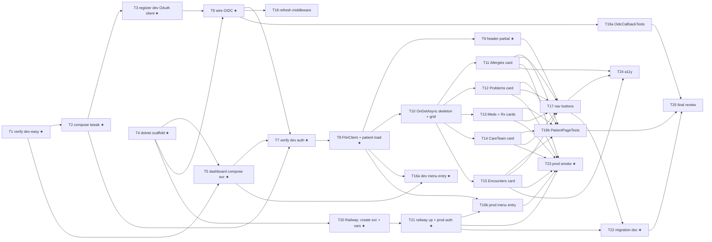

# Patient Dashboard Migration — Task List

Implementation plan: see [week-2-extra-assignment-plan.md](week-2-extra-assignment-plan.md). This file is the working task tracker — flip checkboxes as work progresses.

## Status legend

- `[ ]` not started
- `[~]` in progress
- `[x]` done
- `[!]` blocked (note the blocker on the same line)

★ marks the critical path — the minimum sequence that gets the dashboard demoing in both dev-easy and prod. Anything else can slip.

---

## Dependency graph

## Parallelization summary

The graph implies several windows where work can run concurrently:

- **During setup**: T4 (`dotnet new` scaffold) is independent of T1–T3 and can run alongside them.
- **During Railway deploy**: T20 only depends on T4 and can run anytime after the scaffold — it doesn't block on dev-easy work. T21 unblocks once T20 is done. Both can happen alongside Phase 4–7.
- **Cards**: once T10 is done, T11/T12/T13/T14/T15 are five fully-parallel tasks (different files, different DTOs, different unit tests).
- **Auth refinement vs cards**: T18 (refresh middleware) and T19a (OidcCallbackTests) only depend on T6 — both can run in parallel with the cards phase.

Single developer running with subagents → up to ~3 cards in flight at a time (per project policy on parallel subagents). Solo without subagents → cards can be done in any order; pick the smallest first to build momentum.

---

## Phase 0 — Setup (mostly sequential)

- [ ] **T1** ★ Verify dev-easy stack up (`docker compose up --detach --wait` from `docker/development-easy/`); admin login works at `http://localhost:8300`. *(30m)*
  - Deps: —
- [ ] **T2** ★ Dev-easy compose tweak: flip `OPENEMR_SETTING_site_addr_oath` from `https://localhost:9300` to `http://host.docker.internal:8300` (§4b of plan). Restart openemr. Confirm discovery doc returns JSON. **Production OpenEMR doesn't need this.** *(30m)*
  - Deps: T1
- [ ] **T3** ★ Register dev OAuth client. Try the admin UI first (Admin → System → API Clients) with redirect URI `http://localhost:8400/signin-oidc` and the scopes from §4. If it silently fails, fall back to §11 #1's workaround. Capture client id/secret. *(45m)*
  - Deps: T2

## Phase 1 — Project scaffold (parallel with Phase 0)

- [ ] **T4** ★ `dotnet new` scaffold per §8g. Add `MapHealthChecks("/healthz")` in `Program.cs`. Author `Dockerfile`, `railway.toml`, `.dockerignore`, `.gitignore`. Commit baseline. *(60m)*
  - Deps: —

## Phase 2 — Dashboard container running locally

- [ ] **T5** ★ Add `dashboard-dotnet` compose service block per §8e. `docker compose up --build -d dashboard-dotnet`. Verify `curl http://localhost:8400/healthz` returns 200. *(45m)*
  - Deps: T1, T4

## Phase 3 — Dev auth round-trip (sequential)

- [ ] **T6** ★ Wire OIDC in `Program.cs` per §4d. Read OIDC config from env. Add `[Authorize]` to default Razor Pages convention. Rebuild container. *(75m)*
  - Deps: T3, T4
- [ ] **T7** ★ Verify dev OIDC round-trip end-to-end (visit `http://localhost:8400` → challenge → OpenEMR login → callback → land on `/`). **Checkpoint: dev auth works through the container.** *(60m)*
  - Deps: T2, T5, T6

## Phase 4 — Patient page foundation

- [ ] **T8** ★ Implement `BearerTokenHandler`, `FhirClient`, `FhirPatient` record. `Pages/Patient/Index.cshtml` accepts `{pid}` route param, loads patient by `?identifier=PT|{pid}`. *(75m)*
  - Deps: T7
- [ ] **T9** ★ Render patient header partial (name, DOB+age, gender, MRN, Active/Inactive/Deceased badges). Bootstrap 5 styling. *(60m)*
  - Deps: T8
- [ ] **T10** In `Pages/Patient/Index.cshtml.cs`, add `OnGetAsync` skeleton that fans out FHIR calls via `Task.WhenAll` with a per-call error wrapper. In `Index.cshtml`, lay out the 12-column Bootstrap grid: header partial + six card partial slots. *(45m)*
  - Deps: T8

## Phase 5 — Cards (T11–T15 all parallel-safe)

- [ ] **T11** `_AllergiesCard.cshtml` partial + `FhirAllergy` record + `FhirClient.GetAllergiesAsync` + unit test. *(60m)*
  - Deps: T10
- [ ] **T12** `_ProblemsCard.cshtml` + `FhirCondition` + client method + unit test. *(60m)*
  - Deps: T10
- [ ] **T13** `_MedicationsCard.cshtml` + `_PrescriptionsCard.cshtml` (sharing `FhirMedicationRequest`) + client methods + unit test. *(75m)*
  - Deps: T10
- [ ] **T14** `_CareTeamCard.cshtml` + `FhirCareTeam` + client method + unit test. *(45m)*
  - Deps: T10
- [ ] **T15** `_EncountersCard.cshtml` (the +1 section) + `FhirEncounter` + client method + unit test. *(60m)*
  - Deps: T10

## Phase 6 — Auth refinement + tests (parallel with Phase 5)

- [ ] **T18** Implement `RefreshTokenMiddleware`. Verify a 60-min idle refresh works (let the access token expire, hit a FHIR-backed page, confirm refresh runs and the page renders). *(60m)*
  - Deps: T6
- [ ] **T19a** Write `OidcCallbackTests` — `WebApplicationFactory` boot, GET `/`, assert 302 → authorize URL with `response_type=code`. *(30m)*
  - Deps: T6
- [ ] **T19b** Write `PatientPageTests` — inject fake `FhirClient`, GET `/Patient/1`, parse HTML with AngleSharp, assert 7 card divs (header + 6 clinical cards) contain expected text. *(60m)*
  - Deps: T11, T12, T13, T14, T15

## Phase 7 — Navigation

- [ ] **T16a** ★ Forward nav (dev-easy): add menu entry in `sites/default/documents/custom_menus/patient_menus/Custom.json` pointing at `http://localhost:8400/Patient/{{pid}}` (§7a). Verify clinician picks a patient → "Modern Dashboard" → lands on dashboard with patient pre-selected. *(45m)*
  - Deps: T5, T8
- [ ] **T17** Back nav: "Open in OpenEMR" links per card row + "← Back to OpenEMR" button in header (§7b), URLs built from `OPENEMR_PUBLIC_URL`. Verify each lands correctly with `set_pid`. *(45m)*
  - Deps: T9, T11, T12, T13, T14, T15

## Phase 8 — Production deploy (Railway, mostly parallel with Phases 4–7)

- [ ] **T20** ★ Create `dashboard-dotnet` Railway service (`railway service create dashboard-dotnet` or via dashboard). Set service variables per §8d (prod values from §4a's prod column — `OPENEMR_OIDC_AUTHORITY`, `OPENEMR_PUBLIC_URL`, `OPENEMR_FHIR_BASE_URL` using `${{openemr-web.RAILWAY_PRIVATE_DOMAIN}}`, `DASHBOARD_OIDC_REDIRECT_URI`, `PORT=8080`, `ASPNETCORE_ENVIRONMENT=Production`). Register a prod OAuth client at the Railway-deployed OpenEMR. *(60m)*
  - Deps: T4
- [ ] **T21** ★ `railway up dashboard-dotnet --service dashboard-dotnet` (or extend `deploy-railway.ps1` with a third-pass mirroring its agent-service pass at `Invoke-RailwayAgentServiceDeploy`). Verify Railway reports healthy. Visit the public dashboard URL → OIDC challenge → OpenEMR login → land on `/`. **Checkpoint: prod auth works.** *(45m)*
  - Deps: T20
- [ ] **T16b** Forward nav (prod): add the same menu entry to the **prod** OpenEMR's `Custom.json`, this time pointing at the prod dashboard's public URL. *(15m)*
  - Deps: T8, T21

## Phase 9 — Smoke, docs, polish

- [ ] **T23** ★ End-to-end prod smoke: log into Railway-deployed OpenEMR, navigate to a patient, click "Modern Dashboard", verify all 7 sections render with real data; click "Open in OpenEMR" on a row and "← Back to OpenEMR" — verify both directions land correctly. *(45m)*
  - Deps: T21, T16b, T11, T12, T13, T14, T15
- [ ] **T22** ★ Write `PATIENT_DASHBOARD_MIGRATION.md` from §10 outline. *(75m)*
  - Deps: T17, T21 (need to know what we shipped in both environments)
- [x] **T24** Accessibility pass (keyboard nav, focus rings, ARIA labels on Active/Inactive/Deceased badges, `<th>` scope attrs, semantic landmarks). *(60m)*
  - Deps: T11, T12, T13, T14, T15, T17
- [ ] **T25** Final review of `PATIENT_DASHBOARD_MIGRATION.md`; final `dotnet test` (all green) + `dotnet format` (no diff). *(45m)*
  - Deps: T19a, T19b, T22

---

## Critical path (minimum to demo)

T1 → T2 → T3 → T4 → T5 → T6 → T7 → T8 → T9 → T16a → T20 → T21 → T22 → T23

Anything else can slip and the dashboard still demos in both dev and prod.

## Total effort estimate

22 tasks (counting T16a/b and T19a/b separately), summing to ~21–24 hours of focused work. Well within a 5-day calendar.
